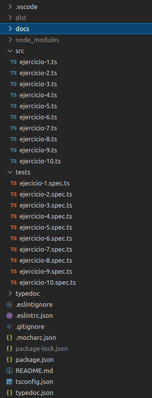
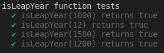
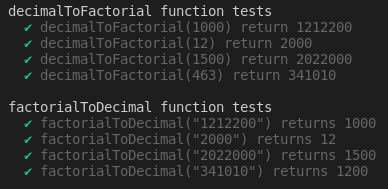
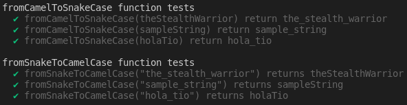
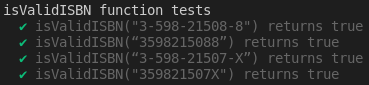
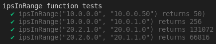
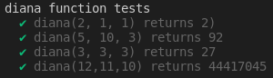
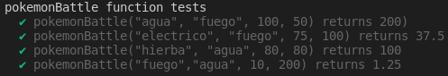
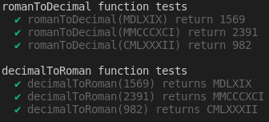
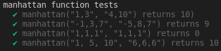

## Introducción
En esta práctica realizaremos 10 ejercicios en TypeScript para prácticar los `datos estáticos y las funciones`, además crearemos el directorio adecuado para desarrollar proyectos en TS y utilizaremos herramientas como `EsLint` para el estilo del código según `Google` en nuestro caso, `TypeDoc` para la generación de la documentación del código de nuestro proyecto y `Mocha` y `Chai` para la creación de pruebas que nos permitiran llevar acabo el desarrollo `TDD`.

## Primeros pasos
Para empezar con esta práctica lo primero que haremos será seguir todos los vídeos tutoriales que se encuentran en el aula virtual para poder instalar todas las herramientas que vamos a usar, además de visitar el apartado de los apuntes de [Creación de un proyecto inicial para trabajar con TypeScrip](https://ull-esit-inf-dsi-2122.github.io/typescript-theory/typescript-project-setup.html), por otro lado también tendremos que visitar los apartados de [Tipos de datos estáticos](https://ull-esit-inf-dsi-2122.github.io/typescript-theory/typescript-static-types.html) y [Funciones](https://ull-esit-inf-dsi-2122.github.io/typescript-theory/typescript-functions.html) ya que los necesitaremos para poder realizar cualquiera de los 10 apartados. 

Una vez hecho todo lo anterior podemos empezar a codificar en TypeScript. El directorio de nuestro proyecto quedaría tal que así:



___Imagen 1___

En la `imagen 1` se puden apreciar los 10 archivos que contendrán el código en TS, los 10 archivos de pruebas respectivos, los archivos de configuración de cada herramienta, el directorio `typedoc` que contendrá la documentación generada con typedoc...

## Ejercicio 1.
En el ejercicio 1 se nos pide realizar un calculador de años `bisiestos` que según un año nos devuelva true si es bisiesto o false si no lo es, en este ejercicio contemplamos 3 casos:
1. Que sea divisible por 4 y no por 100 (bisiesto).
2. Si es divisible por 4 y por 100 tiene que serlo también por 400 (bisiesto).
3. Que no se bisiesto.

Este es el código que he realizado en TS:
```typescript
/**
 * Función que recibe un año y nos dice si es biciesto o no.
 * @param year año que se pasa por parámetro.
 * @returns verdadero si el año es biciesto, falso si no lo es.
 */
export function isLeapYear(year: number): boolean {
  if (year % 4 === 0 && year % 100 !== 0 || year % 400 === 0) {
    return true;
  } else {
    return false;
  }
}
```

Le ponemos el `export` para poder usar esta función en las pruebas. Principalmente miro si es divisible por 4 y no por 100 como expliqué antes o si es divisible entre 400 que esto implicaría que es divisible entre 4 y entre 100 ya que ambos son divisores de 400; si se cumple algo de lo anterior retorno `true`, sino `false`.

Estas son las pruebas que he desarrollado donde he contemplado diferentes casos:
```typescript
import 'mocha';
import {expect} from "chai";
import {isLeapYear} from '../src/ejercicio-1';

describe('isLeapYear function tests', () => {
  it('isLeapYear(1000) returns true', () => {
    expect(isLeapYear(1000)).to.be.equal(false);
  });

  it('isLeapYear(12) returns true', () => {
    expect(isLeapYear(12)).to.be.equal(true);
  });

  it('isLeapYear(1500) returns true', () => {
    expect(isLeapYear(1500)).to.be.equal(false);
  });

  it('isLeapYear(1200) returns true', () => {
    expect(isLeapYear(1200)).to.be.equal(true);
  });
});
```
En la `imagen 2` se puede apreciar como el código pasa las diferentes pruebas.



___Imagen 2___

## Ejercicio 2.
En el ejercicio 2 se pide utilizar la notación factorial, para ello tendremos que desarrollar dos funciones, una es `decimalToFactorial` que pasandole un `número` lo pasa a notación factorial devolviendo un `string` y la otra es `factorialToDecimal` que pasandole un `string`, número en notación factorial, devuelve el número pero en notación decimal es decir un valor `number`.

Para desarrollar las funciones mencionadas necesitaremos una función que nos calcule el fatorial, de esta manera no repetiremos código. Por otro lado necesitaremos saber como funciona la [notación factorial](https://es.wikipedia.org/wiki/Factor%C3%A1dico). En lo personal me costó bastante saber como se pasaba de un número a notación factorial ya que en ese enlace no viene para nada explicado y se da por hecho que se sabe.

El código que he desarrollado es el siguiente:
```typescript
/**
 * Calcula el factorial.
 * @param valor numero al cual se le va a calcular el factorial
 * @returns el valor del factorial.
 */
function factorial(valor: number): number {
  let numero: number = 1;
  
  while (valor > 0) {
    numero *= valor;
    valor--;
  }

  return numero;
}

/**
 * Pasa un numero en notación decimal a notación factorial.
 * @param entero número decimal.
 * @returns número en notación factorial.
 */
export function decimalToFactorial(entero: number): string {
  let valor: number = 1;
  let texto: string = "";
  
  while (entero - factorial(valor) >= 0) {
    valor ++;
  }
  
  valor--;
  while (valor >= 0) {
    texto += (entero / factorial(valor) | 0).toString();
    entero = entero % factorial(valor);
    valor--; 
  }

  return texto;
}

/**
 * Pasa un número en notacón factorial a notación decimal.
 * @param cadena número en notación factorial.
 * @returns numero en notación decimal
 */
export function factorialToDecimal(cadena: string): number {
  let numero: number = 0;
  let contador: number = cadena.length - 1;

  for (let size: number = 0; size < cadena.length; size++) {
    numero += parseInt(cadena.charAt(size), 10) * factorial(contador);
    contador--;
  }
  
  return numero;
}
```

En `factorialToDecimal` miramos cual es el tamaño del string de entrada, siendo `n` este, el mayor factorial que vamos a necesitar para formar el número es `n -1`, partiendo de esto vamos recorriendo el string de izquierda a derecha, lo pasamos a `number` y lo multiplicamos por `(n -1)!` en la primera iteración, en la segunda por `(n -2)!` y así hasta recorrer todo el string, los cáculos los vamos guardadno en un `number` que posteriormente devolveremos.

En `decimalToFactorial` lo primero que tenemos que hacer es saber con que `n!` nos da `numero - n! < 0`, de esta manera sacaremos que el primer factorial es `x = (n-1)!`, sabiendo esto hacemos un bucle `while` hasta que `x = 0!` y `dividimos` el número `decimal` pasado por paŕamentro entre `x`, lo que nos dé lo añadimos al `string` que almecena `la notación decimal` y el resto de esa división es el nuevo decimal y así sucesivamente hasta llegar a `0!`.


Estas son las pruebas que he desarrollado donde he contemplado diferentes casos:
```typescript
import 'mocha';
import {expect} from "chai";
import {decimalToFactorial, factorialToDecimal} from '../src/ejercicio-2';

describe('decimalToFactorial function tests', () => {
  it('decimalToFactorial(1000) return 1212200', () => {
    expect(decimalToFactorial(1000)).to.be.equal("1212200");
  });

  it('decimalToFactorial(12) return 2000', () => {
    expect(decimalToFactorial(12)).to.be.equal("2000");
  });

  it('decimalToFactorial(1500) return 2022000', () => {
    expect(decimalToFactorial(1500)).to.be.equal("2022000");
  });

  it('decimalToFactorial(463) return 341010', () => {
    expect(decimalToFactorial(463)).to.be.equal("341010");
  });
});

describe('factorialToDecimal function tests', () => {
  it('factorialToDecimal("1212200") returns 1000', () => {
    expect(factorialToDecimal("1212200")).to.be.equal(1000);
  });
  
  it('factorialToDecimal("2000") returns 12', () => {
    expect(factorialToDecimal("2000")).to.be.equal(12);
  });
  
  it('factorialToDecimal("2022000") returns 1500', () => {
    expect(factorialToDecimal("2022000")).to.be.equal(1500);
  });
  
  it('factorialToDecimal("341010") returns 1200', () => {
    expect(factorialToDecimal("341010")).to.be.equal(463);
  });
});

```
En la `imagen 3` se puede apreciar como el código pasa las diferentes pruebas.



___Imagen 3___

## Ejercicio 3.

En el ejercicio 3 nos piden pasar cadenas que se encuentran en formato `CamelCase` a formato `SnakeCase` mediante la función `fromCamelToSnakeCase` y al revés mediante la función `fromSnakeToCamelCase`. Ambas funciones reciben una cadena y devuelven otra. EL códgio en TS es el siguiente:
```typescript
/**
 * Función que pasa una cadena en formato SnakeCase a formato CamelCase.
 * @param snake cadena en formato SnakeCase
 * @returns cadena en formato CamelCase.
 */
export function fromSnakeToCamelCase(snake: string): string {
  let camel: string = "";

  for (let size: number = 0; size < snake.length; size++) {
    if (snake.charAt(size) === "_") {
      size++;
      camel += snake.charAt(size).toUpperCase();
    } else {
      camel += snake.charAt(size);
    }
  }

  return camel;
}

/**
 * Función que pasa una cadena en formato CamelCase a formato SnakeCase.
 * @param camel cadena en formato CamelCase
 * @returns cadena en formato SnakeCase.
 */
export function fromCamelToSnakeCase(camel: string): string {
  let snake: string = "";
  
  for (let size: number = 0; size < camel.length; size++) {
    if (camel.charAt(size) === camel.charAt(size).toUpperCase()) {
      snake += "_" + camel.charAt(size).toLowerCase();
    } else {
      snake += camel.charAt(size);
    }
  }

  return snake;
}
```

Para pasar de `CamelCase` a `SnakeCase` hemos recorrido la cadena y hemos guardado cada elemento en una cadena nueva, si nos encontabamos una mayúscula teníamos que añadir una `_` a la cadena nueva y luego la letra mayúscual en `minúscula`. Para pasar de `SnakeCase` a `CamelCase` hemos recorrido la cadena y hemos guardado cada elemento en una cadena nueva, si nos encontrabamos una `_` avanzabamos uno en la cadena y añadimos la letra en `mayúscula` a la cadena nueva.

Estas son las pruebas que he desarrollado donde he contemplado diferentes casos:
```typescript
import 'mocha';
import {expect} from "chai";
import {fromCamelToSnakeCase, fromSnakeToCamelCase} from '../src/ejercicio-3';

describe('fromCamelToSnakeCase function tests', () => {
  it('fromCamelToSnakeCase(theStealthWarrior) return the_stealth_warrior', () => {
    expect(fromCamelToSnakeCase("theStealthWarrior")).to.be.equal("the_stealth_warrior");
  });

  it('fromCamelToSnakeCase(sampleString) return sample_string', () => {
    expect(fromCamelToSnakeCase("sampleString")).to.be.equal("sample_string");
  });

  it('fromCamelToSnakeCase(holaTio) return hola_tio', () => {
    expect(fromCamelToSnakeCase("holaTio")).to.be.equal("hola_tio");
  });
});

describe('fromSnakeToCamelCase function tests', () => {
  it('fromSnakeToCamelCase("the_stealth_warrior") returns theStealthWarrior', () => {
    expect(fromSnakeToCamelCase("the_stealth_warrior")).to.be.equal("theStealthWarrior");
  });
  
  it('fromSnakeToCamelCase("sample_string") returns sampleString', () => {
    expect(fromSnakeToCamelCase("sample_string")).to.be.equal("sampleString");
  });
  
  it('fromSnakeToCamelCase("hola_tio") returns holaTio', () => {
    expect(fromSnakeToCamelCase("hola_tio")).to.be.equal("holaTio");
  });
});
```
En la `imagen 4` se puede apreciar como el código pasa las diferentes pruebas.



___Imagen 4___

## Ejercicio 4.

En el ejercicio 4 nos piden que verifiquemos si un código `ISBN-10` es correcto, para ello nos pasan el código en una `cadena` y devolvemos un `boolean` indicando si es un código ISBN-10 correcto. El código es el siguiente:
```typescript
/**
 * Función que comprueba si una cadena está en formato ISBN-10.
 * @param isbn cadena en formato ISBN-10
 * @returns verdadero si la cadena cumple el formato ISBN-10, falso si no.
 */
export function isValidISBN(isbn: string): boolean {
  let sum: number = 0;
  let contador: number = 10;

  for (let size: number = 0; size < isbn.length; size++) {
    if (isbn.charAt(size) !== "-") {
      if (isbn.charAt(size) === "X") {
        sum += 10 * contador;
      } else {
        sum += parseInt(isbn.charAt(size)) * contador;
      }
      contador--;
    }
  }
  return sum % 11 === 0;
}
```

Este ejercicio era sencillo solo hay que aplicar una fórmula que se nos proporciona en el enunciado, lo único a tener en cuenta es que tenemos que pasar el número que se encuentra en la cadena a `number` para poder hacer los cálculos y que la cadena admite dos formatos, uno con `-` otro sin, es por esto que tenemos que recorrer la cadena y si nos encontramos un `-` no hacemos nada. Por otro lado el número 10 se representa con una `X`, cuando nos encotremos la `X` ponemos un 10.

Estas son las pruebas que he desarrollado donde he contemplado diferentes casos:
```typescript
import 'mocha';
import {expect} from "chai";
import {isValidISBN} from '../src/ejercicio-4';

describe('isValidISBN function tests', () => {
  it('isValidISBN("3-598-21508-8") returns true', () => {
    expect(isValidISBN("3-598-21508-8")).to.be.equal(true);
  });

  it('isValidISBN(“3598215088”) returns true', () => {
    expect(isValidISBN("3598215088")).to.be.equal(true);
  });

  it('isValidISBN(“3-598-21507-X”) returns true', () => {
    expect(isValidISBN("3-598-21507-X")).to.be.equal(true);
  });

  it('isValidISBN("359821507X") returns true', () => {
    expect(isValidISBN("359821507X")).to.be.equal(true);
  });
});
```
En la `imagen 5` se puede apreciar como el código pasa las diferentes pruebas.



___Imagen 5___

## Ejercicio 5.

En el ejercicio 5 se nos pide que reordenemos en orden descendente un número para poder formar el número de máximo valor con esos dígitos. El código es el siguiente:
```typescript
/**
 * Función que ordena un número en orden descendente.
 * @param numero número en notación decimal
 * @returns número en notación decimal
 */
export function ordenDescendente(numero: number): number {
  let cadena: string = numero.toString();
  let aux: string = "";
  let mayor: number;

  while (cadena.length > 0) {
    mayor = 0;
    for (let size: number = 0; size < cadena.length; size++) {
      if (parseInt(cadena.charAt(mayor)) < parseInt(cadena.charAt(size))) {
        mayor = size;
      }
    }
    aux += cadena.substring(mayor, mayor + 1);
    cadena = cadena.substring(0, mayor) + 
             cadena.substring(mayor + 1, cadena.length);
  }

  return parseInt(aux);
}
```

Para resolver este ejercicio hemos pasado el número a `string` para poder recorrer de una forma sencilla cada dígito, una vez hecho esto, buscamos el dígito de mayor tamaño, lo obtenemos, lo añadimos a un `string` nuevo y lo eliminamos de la cadena principal. Repetiremos esto hasta que la cadena principal quede vacía y luego retornaremos la cadena pasada a `number`.

Estas son las pruebas que he desarrollado donde he contemplado diferentes casos:
```typescript
import 'mocha';
import {expect} from "chai";
import {ordenDescendente} from '../src/ejercicio-5';

describe('ordenDescendente function tests', () => {
  it('ordenDescendente(54192) returns 95421)', () => {
    expect(ordenDescendente(54192)).to.be.equal(95421);
  });

  it('ordenDescendente(145263) returns 654321', () => {
    expect(ordenDescendente(145263)).to.be.equal(654321);
  });

  it('ordenDescendente(123456789) returns 987654321', () => {
    expect(ordenDescendente(123456789)).to.be.equal(987654321);
  });

  it('ordenDescendente(42145) returns 54421', () => {
    expect(ordenDescendente(42145)).to.be.equal(54421);
  });
});
```
En la `imagen 6` se puede apreciar como el código pasa las diferentes pruebas.


___Imagen 6___

## Ejercicio 6.

En el ejercicio 6 se nos pide que según dos IPV4 que se nos pasan como cadenas calculemos cuantas direcciones disponibles hay entre las dos IPs. El código es el siguiente:
```typescript
/**
 * Funcion que calcula la diferencia de dos número en valor absoluto.
 * @param n1 numero decimal
 * @param n2 numero decimal 
 * @returns numero decimal
 */
function abs(n1: number, n2: number): number {
  const aux: number = n1 - n2;
  
  if (aux < 0) {
    return aux * -1;
  } else {
    return aux;
  }
}
/**
 * Funcion que eleva un número a otro.
 * @param n1 numero decimal.
 * @param n2 numero decimal.
 * @returns numero decimal.
 */
function pow(n1: number, n2: number): number {
  let aux: number = 1;
  for (let size: number = 0; size < n2; size++) {
    aux *= n1;
  }
  return aux;
}
/**
 * Funcion que calcula las direcciones disponibles entre dos IPV4.
 * @param n1 Cadena que contiene una IPV4
 * @param n2 Cadena que contiene una IPV4
 * @returns numero decimal
 */
export function ipsInRange(ip1: string, ip2: string): number {
  const ip1Parts: string[] = ip1.split(".");
  const ip2Parts: string[] = ip2.split(".");
  let sum1: number = 0;
  let sum2: number = 0;
  let cont: number = 3;

  for (let size: number = 0; size < 4; size++) {
    if (ip1Parts[size] !== ip2Parts[size]) {
      sum1 += pow(256, cont) * parseInt(ip1Parts[size]);
      sum2 += pow(256, cont) * parseInt(ip2Parts[size]);
    }
    cont--;
  }
  return abs(sum1, sum2);
}
```

Lo primero a tener en cuentas es que las `IPV4` tiene 4 campos de `256` valores cada uno `(0-255)`, por ende de izquierda a derecha cada campo representa `n * 256³` ips, `n * 256²` ips, `n * 256¹` ips y `n * 256⁰` ips, siendo `n` el número que se encuentra en la IP. Separaremos cada campo de las IPs en una posición de un array de string y comparamos cada campo de las IPs, en el caso de que sean diferentes calculamos el número de ips y lo guardamos en un number para finalmente devolver la `diferencia` en `valor absoluto`.

Estas son las pruebas que he desarrollado donde he contemplado diferentes casos:
```typescript
import 'mocha';
import {expect} from "chai";
import {ipsInRange} from '../src/ejercicio-6';

describe('ipsInRange function tests', () => {
  it('ipsInRange("10.0.0.0", "10.0.0.50") returns 50)', () => {
    expect(ipsInRange("10.0.0.0", "10.0.0.50")).to.be.equal(50);
  });

  it('ipsInRange("10.0.0.0", "10.0.1.0") returns 256', () => {
    expect(ipsInRange("10.0.0.0", "10.0.1.0")).to.be.equal(256);
  });

  it('ipsInRange("20.2.1.0", "20.0.1.0") returns 131072', () => {
    expect(ipsInRange("20.2.1.0", "20.0.1.0")).to.be.equal(131072);
  });

  it('ipsInRange("20.2.6.0", "20.1.1.0") returns 66816', () => {
    expect(ipsInRange("20.2.6.0", "20.1.1.0")).to.be.equal(66816);
  });
});
```
En la `imagen 7` se puede apreciar como el código pasa las diferentes pruebas.



___Imagen 7___

## Ejercicio 7.

En el ejercicio 7 se nos pide que calculemos cuantas cabezas tendrá `Cerberus` tras una cantidad `n` de ataques de `Diana`, sabiendo que tiene inicialmente una cantidad `x` de cabezas y que cada vez que le cortemos una cabeza le saldran `y` cabezas nuevas.
```typescript
/**
 * Calcula el factorial.
 * @param valor numero al cual se le va a calcular el factorial
 * @returns el valor del factorial.
 */
function factorial(valor: number): number {
  let numero: number = 1;
  
  while (valor > 0) {
    numero *= valor;
    valor--;
  }

  return numero;
}

/**
 * Funcion que calcula las cabezas que le salen a Cerberus después 
 * de que Diana se las corte
 * @param cabezaIniciales número decimal, cantidad de cabezas que tiene Cerberus
 * @param n número decimal, cantidad de cabezas que le van a salir a Cerberus 
 * después de que una sea cortada
 * @param ataques número decimal, cantidad de ataques que Diana va a hacer
 * @returns número decimal, cantidad de cabezas finales de Cerberus.
 */
export function diana(cabezaIniciales: number, n: number, 
    ataques: number): number {
  let cabezaFinal: number = cabezaIniciales;

  for (let size: number = 1; size <= ataques; size++) {
    cabezaFinal = cabezaFinal - 1 + n * factorial(size);
  }

  return cabezaFinal;
}
```

Este ejercicio es muy sencillo solo hay que tener en cuenta que por cada ataque hay que multiplicar `n` por el factorial del ataque, es decir, si es el primer ataque sería `n` * 1! y si es el 5 sería `n` * 5!.

Estas son las pruebas que he desarrollado donde he contemplado diferentes casos:
```typescript
import 'mocha';
import {expect} from "chai";
import {diana} from '../src/ejercicio-7';

describe('diana function tests', () => {
  it('diana(2, 1, 1) returns 2)', () => {
    expect(diana(2, 1, 1)).to.be.equal(2);
  });

  it('diana(5, 10, 3) returns 92', () => {
    expect(diana(5, 10, 3)).to.be.equal(92);
  });

  it('diana(3, 3, 3) returns 27', () => {
    expect(diana(3, 3, 3)).to.be.equal(27);
  });

  it('diana(12,11,10) returns 44417045', () => {
    expect(diana(12, 11, 10)).to.be.equal(44417045);
  });
});
```
En la `imagen 8` se puede apreciar como el código pasa las diferentes pruebas.



___Imagen 8___

## Ejercicio 8.

En el ejercicio 8 nos piden realizar una función que calcule el daño que hará nuestro pokemon en un combate pokemon según sea `nuestro tipo`, el del `rival`, `nuestro ataque` y `su defensa`.
```typescript
/**
 * Función que calcula el daño que hace nuestro pokemon en una batalla.
 * @param miTipo Cadena que contiene el tipo de nuestro pokemon
 * @param tipoOpo Cadena que contiene el tipo del pokemon del rival
 * @param miAtaq número decimal, ataque de nuestro pokemon.
 * @param defOpo número decimal, defensa del pokemon del rival.
 * @returns número decimal, daño que nuestro pokemon inflije al rival.
 */
export function pokemonBattle(miTipo: string, tipoOpo: string, 
    miAtaq: number, defOpo: number): number {
  const superEfec: number = 2;
  const normal: number = 1;
  const pocoEfec: number = 0.5;
  let damage: number = 50 * (miAtaq / defOpo);
  
  switch (miTipo) {
    case "fuego":
      switch (tipoOpo) {
        case "fuego":
          damage *= pocoEfec;
          break;
        case "agua":
          damage *= pocoEfec;
          break;
        case "hierba":
          damage *= superEfec;
          break;
        case "electrico":
          damage *= normal;
          break;
      }
      break;

    case "agua":
      switch (tipoOpo) {
        case "fuego":
          damage *= superEfec;
          break;
        case "agua":
          damage *= pocoEfec;
          break;
        case "hierba":
          damage *= pocoEfec;
          break;
        case "electrico":
          damage *= pocoEfec;
          break;
      }
      break;

    case "hierba":
      switch (tipoOpo) {
        case "fuego":
          damage *= pocoEfec;
          break;
        case "agua":
          damage *= superEfec;
          break;
        case "hierba":
          damage *= pocoEfec;
          break;
        case "electrico":
          damage *= normal;
          break;
      }
      break;

    case "electrico":
      switch (tipoOpo) {
        case "fuego":
          damage *= normal;
          break;
        case "agua":
          damage *= superEfec;
          break;
        case "hierba":
          damage *= normal;
          break;
        case "electrico":
          damage *= pocoEfec;
          break;
      }
      break;
  }
  return damage;
}
```
Este ejercicio no tenía mucha ciencia, solamente teníamos que mirar nuestro tipo y mirar el del revial, para hacer los calculos luego. He usado `un switch` para mirar el tipo de mi pokemon y luego dentro de `cada case` otro `switch` para mirar el tipo del pokemon rival.

Estas son las pruebas que he desarrollado donde he contemplado diferentes casos:
```typescript
import 'mocha';
import {expect} from "chai";
import {pokemonBattle} from '../src/ejercicio-8';

describe('pokemonBattle function tests', () => {
  it('pokemonBattle("agua", "fuego", 100, 50) returns 200)', () => {
    expect(pokemonBattle("agua", "fuego", 100, 50)).to.be.equal(200);
  });

  it('pokemonBattle("electrico", "fuego", 75, 100) returns 37.5', () => {
    expect(pokemonBattle("electrico", "fuego", 75, 100)).to.be.equal(37.5);
  });

  it('pokemonBattle("hierba", "agua", 80, 80) returns 100', () => {
    expect(pokemonBattle("hierba", "agua", 80, 80)).to.be.equal(100);
  });

  it('pokemonBattle("fuego","agua", 10, 200) returns 1.25', () => {
    expect(pokemonBattle("fuego", "agua", 10, 200)).to.be.equal(1.25);
  });
});
```
En la `imagen 9` se puede apreciar como el código pasa las diferentes pruebas.



___Imagen 9___

## Ejercicio 9.

En el ejercicio 9 nos piden que hagamos `2 funciones`, una que convierta un número `romano` a `decimal` y otra que haga lo contrario, el número romano se pasará como una `cadena` y el número decimal se pasará como un `number`. El código es el siguiente:
```typescript
/**
 * Función que devuelve el valor de la letra que le pasemos por parámetro.
 * @param letra cadena que contiene una letra romana.
 * @returns número decimal equivalente al valor de la letra.
 */
function relacionLetraValor(letra: string): number {
  switch (letra) {
    case "M":
      return 1000;
    case "D":
      return 500;
    case "C":
      return 100;
    case "L":
      return 50;
    case "X":
      return 10;
    case "V":
      return 5;
    case "I":
      return 1;
    default:
      return -1;
  }
}

/**
 * Función que convierte un numero romano en decimal.
 * @param roman cadena que contiene un número romano.
 * @returns número decimal.
 */
export function romanToDecimal(roman: string): number {
  let valor: number = 0;
  let ultimoValor: number = 0;
  let resultado: number = 0;
  
  for (let size: number = 0; size < roman.length; size++) {  
    valor = relacionLetraValor(roman.charAt(size));
    resultado += valor;

    if (valor > ultimoValor) {
      resultado -= 2 * ultimoValor;
    }

    ultimoValor = valor;
  }
  return resultado;
}

/**
 * Función que convierte un numero decimal en romano.
 * @param roman numero decimal.
 * @returns numero romano.
 */
export function decimalToRoman(roman: number): string {
  const cadena: string = roman.toString();

  const vectorM: string[] = ["M", "MM", "MMM"];
  const vectorC: string[] = ["C", "CC", "CCC", "CD", "D", 
    "DC", "DCC", "DCCC", "CM"];
  const vectorD: string[] = ["X", "XX", "XXX", "XL", "L", 
    "LX", "LXX", "LXXX", "XC"];
  const vectorU: string[] = ["I", "II", "III", "IV", "V",
    "VI", "VII", "VIII", "IX"];

  switch (cadena.length) {
    case 1:
      return vectorU[parseInt(cadena.charAt(0)) -1];
    case 2:
      return vectorD[parseInt(cadena.charAt(0)) -1] + 
             vectorU[parseInt(cadena.charAt(1)) -1];
    case 3:
      return vectorC[parseInt(cadena.charAt(0)) -1] + 
             vectorD[parseInt(cadena.charAt(1)) -1] + 
             vectorU[parseInt(cadena.charAt(2)) -1];
    default:
      return vectorM[parseInt(cadena.charAt(0)) -1] + 
             vectorC[parseInt(cadena.charAt(1)) -1] + 
             vectorD[parseInt(cadena.charAt(2)) -1] + 
             vectorU[parseInt(cadena.charAt(3)) -1];
  }
}

```

Lo que tenemos que tener en cuenta es que solo podemos representar los `3999` primeros `número romanos`, partiendo de esto en la función `decimalToRoman` sacamos cada dígito del número decimal y vemos cual es su correspondiente en los `arrays de string` que tenemos y retornamos el resultado. En la función `romanToDecimal` vamos recorriendo el `número romano` y con otra función vamos calculando el `valor de cada letra` y guardandolo en un dato de tipo number que retornaremos finalmente. En este caso hay que tener en cuenta que `un número` puede ser compuesto por `varias letras`, es decir, el `400` que sería `CD` si añadimos letra por letra se convertiría en el `600, 100 + 500`; por esto mismo tenemos que tener un `condicional` que mira si la letra que hemos añadido tiene mayor valor que la anterior que hemos añadido, y en ese caso le restamos 2 veces el valor de la letra anterior. Vamos a ver un ejemplo con CD:
```
CD = 400, según nuestro código añadimos primero C, x += 100, luego nos encontramos con D, entonces x += 500, aquí x = 600 pero como D > C, x -= 2 * 100 -> x = 400.
```

Estas son las pruebas que he desarrollado donde he contemplado diferentes casos:
```typescript
import 'mocha';
import {expect} from "chai";
import {romanToDecimal, decimalToRoman} from '../src/ejercicio-9';

describe('romanToDecimal function tests', () => {
  it('romanToDecimal(MDLXIX) return 1569', () => {
    expect(romanToDecimal("MDLXIX")).to.be.equal(1569);
  });

  it('romanToDecimal(MMCCCXCI) return 2391', () => {
    expect(romanToDecimal("MMCCCXCI")).to.be.equal(2391);
  });

  it('romanToDecimal(CMLXXXII) return 982', () => {
    expect(romanToDecimal("CMLXXXII")).to.be.equal(982);
  });
});

describe('decimalToRoman function tests', () => {
  it('decimalToRoman(1569) returns MDLXIX', () => {
    expect(decimalToRoman(1569)).to.be.equal("MDLXIX");
  });
  
  it('decimalToRoman(2391) returns MMCCCXCI', () => {
    expect(decimalToRoman(2391)).to.be.equal("MMCCCXCI");
  });
  
  it('decimalToRoman(982) returns CMLXXXII', () => {
    expect(decimalToRoman(982)).to.be.equal("CMLXXXII");
  });
});
```
En la `imagen 10` se puede apreciar como el código pasa las diferentes pruebas.



___Imagen 10___

## Ejercicio 10.

En el ejercico 10 nos piden que calculemos la distancia de Manhattan entre dos puntos de cualquier dimensión siempre y cuando tengan las mismas dimensiones. El código desarrollado es el siguiente:
```typescript
/**
 * Funcion que calcula la diferencia de dos número en valor absoluto.
 * @param n1 numero decimal
 * @param n2 numero decimal 
 * @returns numero decimal
 */
function abs(n1: number, n2: number): number {
  const aux: number = n1 - n2;
  
  if (aux < 0) {
    return aux * -1;
  } else {
    return aux;
  }
}

/**
 * Función que calcula la distancia de Manhattan.
 * @param p1 cadena que contiene un punto.
 * @param p2 cadena que contiene un punto.
 * @returns numero decimal.
 */
export function manhattan(p1: string, p2: string): number {
  const p1Parts: string[] = p1.split(",");
  const p2Parts: string[] = p2.split(",");
  let sum: number = 0;

  for (let size: number = 0; size < p1Parts.length; size++) {
    sum += abs(parseInt(p1Parts[size]), parseInt(p2Parts[size]));
  }
  return sum;
}
```

Esta función separa cada dimensión en una posición de un array de string y realiza el sumatorio de las diferencias en valor absoluto de todas dimensión. Basicamente es una función que hemos trabajado en otras asignaturas como IA y simplemente hay que seguir una fórmula.

Estas son las pruebas que he desarrollado donde he contemplado diferentes casos:
```typescript
import 'mocha';
import {expect} from "chai";
import {manhattan} from '../src/ejercicio-10';

describe('manhattan function tests', () => {
  it('manhattan("1,3", "4,10") returns 10)', () => {
    expect(manhattan("1,3", "4,10")).to.be.equal(10);
  });

  it('manhattan("-1,3,7", "-5,8,7") returns 9', () => {
    expect(manhattan("-1,3,7", "-5,8,7")).to.be.equal(9);
  });

  it('manhattan("1,1,1", "1,1,1") returns 0', () => {
    expect(manhattan("1,1,1", "1,1,1")).to.be.equal(0);
  });

  it('manhattan("1, 5, 10", "6,6,6") returns 10', () => {
    expect(manhattan("1, 5, 10", "6,6,6")).to.be.equal(10);
  });
});
```
En la `imagen 11` se puede apreciar como el código pasa las diferentes pruebas.



___Imagen 11___

## Conclusión.

Como conclusión a esta práctica puedo decir que TS es un lenguaje interesante y que además de contar con el tipado estático cuenta con la versatilidad de JS, además las herramientas que estamos utilizando nos ficilitan mucho el trabajo y nos permiten hacer desarrollos completos y complejos.
