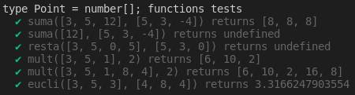

## Introducción
En esta práctica realizaremos 10 ejercicios en TypeScript para prácticar los `Arrays, tuplas y enumerados`, además crearemos el directorio adecuado para desarrollar proyectos en TS y utilizaremos herramientas como `EsLint` para el estilo del código según `Google` en nuestro caso, `TypeDoc` para la generación de la documentación del código de nuestro proyecto y `Mocha` y `Chai` para la creación de pruebas que nos permitiran llevar acabo el desarrollo `TDD`.

## Primeros pasos
Para empezar con esta práctica lo primero que haremos será seguir todos los vídeos tutoriales que se encuentran en el aula virtual para poder instalar todas las herramientas que vamos a usar, además de visitar el apartado de los apuntes de [Creación de un proyecto inicial para trabajar con TypeScrip](https://ull-esit-inf-dsi-2122.github.io/typescript-theory/typescript-project-setup.html), por otro lado también tendremos que visitar los apartados de [Tipos de datos estáticos](https://ull-esit-inf-dsi-2122.github.io/typescript-theory/typescript-static-types.html), [Funciones](https://ull-esit-inf-dsi-2122.github.io/typescript-theory/typescript-functions.html) y [Arrays, tuplas y enumerados](https://ull-esit-inf-dsi-2122.github.io/typescript-theory/typescript-arrays-tuples-enums.html) ya que los necesitaremos para poder realizar cualquiera de los 10 apartados. 

Una vez hecho todo lo anterior podemos empezar a codificar en TypeScript. El directorio de nuestro proyecto quedaría tal que así:


___Imagen 1___

En la `imagen 1` se pueden apreciar los 10 archivos que contendrán el código en TS, los 10 archivos de pruebas respectivos, los archivos de configuración de cada herramienta, el directorio `typedoc` que contendrá la documentación generada con typedoc...

## Ejercicio 1.

En el `ejercicio 1` nos piden que desarrollaremos un método, `productTable` que según un `número entero positivo mayor que 0` devolvamos un array de arrays de numbers que tendrá en su interior `n` tablas de multiplicar formadas por `n` números cada una. El código que he desarrollado es el siguiente:
```typescript
/**
 * ___Función que devuelve n tablas de multiplicar con n valores___
 * @param n number que indica la cantidad de tablas de multiplicar y la 
 * cantidad de valores.
 * @returns array de array de numbers con las tablas de multiplicar.
 */
export function productTable(n: number): number[][] | undefined {
  const table: number[][] = [];
  
  if (n < 1) {
    return undefined;
  }

  let aux: number[] = [];
  let numero1: number = 1;
  let numero2: number = 1;

  while (numero1 <= n) {    
    while (numero2 <= n) {
      aux.push(numero2 * numero1);
      numero2++;
    }
    numero1++;
    numero2 = 1;
    table.push(aux);
    aux = [];
  }

  return table;
}
```

Principalmente hay que usar dos bucles, uno para formar cada tabla y otro para formar los números de dicha tabla, en mi caso he usado `2 while`. Para rellenar el `number[][]` haremos `.push()` de un `number[]` que a su vez haremos `.push()` con cada número de la tabla para rellenarlo. Una vez tengamos en cuenta lo anterior solo hay que multiplicar `numero1` por `numero2`, siendo `número1` el número de la tabla y `número2` la posición en la tabla, empezando en el `1`. Por ejemplo: 

Para la tabla del `2` `numero1 = 2` y para calcular el `segundo valor` de la tabla del 2 `número2 = 2`, por ende la `segunda posición de la segunda tabla = 2 * 2 = 4`.

Estas son las pruebas que he desarrollado donde he contemplado diferentes casos, tanto casos de éxito como de fracaso:
```typescript
import 'mocha';
import {expect} from "chai";
import {productTable} from '../src/ejercicio-1';

describe('productTable function tests', () => {
  it('productTable(3) returns [[ 1, 2, 3 ], [ 2, 4, 6 ], [ 3, 6, 9 ]]', () => {
    expect(productTable(3)).to.eql([[1, 2, 3], [2, 4, 6], [3, 6, 9]]);
  });
  it('productTable(1) returns [ [ 1 ] ]', () => {
    expect(productTable(1)).to.eql([[1]]);
  });
  it('productTable(5) returns  [[ 1, 2, 3, 4, 5 ], [ 2, 4, 6, 8, 10 ], [ 3, 6, 9, 12, 15 ], [ 4, 8, 12, 16, 20 ], [ 5, 10, 15, 20, 25 ]]', () => {
    expect(productTable(5)).to.eql([[1, 2, 3, 4, 5], [2, 4, 6, 8, 10], 
      [3, 6, 9, 12, 15], [4, 8, 12, 16, 20], [5, 10, 15, 20, 25]]);
  });
  it('productTable(-3) returns undefined', () => {
    expect(productTable(-3)).to.be.equal(undefined);
  });
  it('productTable(-8) returns undefined', () => {
    expect(productTable(-8)).to.be.equal(undefined);
  });
});
```

En la `imagen 2` se puede apreciar como el código pasa las diferentes pruebas.


___Imagen 2___

## Ejercicio 2.

En el `ejercicio 2` nos piden realizar 2 funciones, `fromArrayToRanges` y `fromRangesToArray` que son funciones que según un array de numbers devuelve un string que contiene los rangos de ese array y viceversa respectivamente. El código que he desarrollado es el siguiente:
```typescript
/**
 * ___Función que convierte los valores array en una cadena con rangos___
 * @param rango array de numbers que contiene los números en orden ascendente
 * @returns cadena con los rangos.
 */
export function fromArrayToRanges(rango: number[]): string | undefined {
  let cadena: string = "";
  if (rango.length === 0) {
    return undefined;
  }
  // Guardamos el incio del tramo.
  let inicio: number = rango[0];
  let pibote: number = rango[0];
  
  for (let elemento = 1; elemento < rango.length; elemento++) {
    // Si no están ordenados de forma ascendente.
    if (pibote >= rango[elemento]) {
      return undefined;
      // Si son consecutivos.
    } else if (pibote + 1 === rango[elemento]) {
      pibote++;
      // Si no son consecutivos.
    } else {
      // Si pibote ha avanzado quiere decir que era un tramo y no un número
      // solo.
      if (inicio !== pibote) {
        cadena += inicio.toString() + "_" + pibote.toString() + ",";
      // Pibote no ha avanzado, se trata de un número suelto.
      } else {
        cadena += inicio.toString() + ",";
      }
      // Reestablecemos el inicio y le pibote.
      inicio = rango[elemento];
      pibote = rango[elemento];
    }
  }
  
  // Miramos los últimos números.
  if (inicio !== pibote) {
    cadena += inicio.toString() + "_" + pibote.toString();
  } else {
    cadena += inicio.toString();
  }
  return cadena;
}

/**
 * ___Función que convierte una cadena con rangos en un array ascendente___
 * @param cadena cadena que contiene valores entre rangos, y sueltos.
 * @returns array de numbers que contiene los números en orden ascendente.
 */
export function fromRangesToArray(cadena: string): number[] | undefined {
  if (cadena.length < 1) {
    return undefined;
  }
  // Miramos que en la cadena solo hayan numeros, ',' y '_'
  for (let elemento = 0; elemento < cadena.length; elemento++) {
    if (!cadena[elemento].match(/^[0-9]+$/) && cadena[elemento] !== "_" && 
          cadena[elemento] !== "," ) {
      return undefined;
    }
  }
  const rango: number[] = [];
  // Separamos la cadena por las ','
  const partes: string[] = cadena.split(",");
  let aux: string[];
  
  // Recorremos cada fragmento.
  for (let elemento = 0; elemento < partes.length; elemento++) {
    // Si contiene una '_'
    if (partes[elemento].search(/_/gm) !== -1) {
      // la separamos en 2 partes.
      aux = partes[elemento].split("_");
      // Miramos que solo sean números.
      if (!aux[0].match(/^[0-9]+$/) || !aux[1].match(/^[0-9]+$/)) {
        return undefined;
      }
      // Miramos que el número más a la der sea mayor que el de la izq.
      if (parseInt(aux[0]) >= parseInt(aux[1])) {
        return undefined;
      }
      // Añadimos los números que se encuentran entre el tramo.
      for (let contador = parseInt(aux[0]); contador <= parseInt(aux[1]);
        contador++) {
        rango.push(contador);
      }
      // Si no tiene '_' añadimos directamente el número.
    } else {
      rango.push(parseInt(partes[elemento]));
    }
  }
  
  // Miramos que los número hayan quedado en orden ascendete y no se repitan.
  for (let elemento = 1; elemento < rango.length; elemento++) {
    if (rango[elemento] <= rango[elemento - 1]) {
      return undefined;
    }
  }
    
  return rango;
}
```

Este ejercicio tenía cierta `complejidad`, no por lo `difícil` que pueda ser desarrollar las funciones en sí sino más bien po la complejidad que nos genera contemplar todos los casos donde la `entrada` de las `funciones` tenga un `formato incorrecto`. Por ejemplo en la función `fromArrayToRanges` que recibe un array de numbers de entrada el array tiene que estar `ordenado` de forma `ascendente`, no pueden haber `números repetidos` y no puede estar `vacío`; por otro lado en la función `fromRangesToArray` que recibe un string de entra tenemos que comprobar que el string no esté `vacío`, que solo tenga `números`, `_` y `,`, que los números estén `ordenados` en orden `ascendente`, que no haya `números repetidos` y que tenga el `formato adecuado`.

Ahora vamos a explicar como he resuelto `fromArrayToRanges`, lo primero que hacemos es mirar que el tamaño del array sea `mayor que 0`, luego inicializamos un number llamado `inicio` que contendra el `primer valor del array` y un number llamado `pibote` que será el que iremos moviendo y que contiene el `primer valor del array`, empezamos `recorriendo el array` desde la `posición 1` y mirando si el valor en cuestión es `valor === pibote + 1`, ya que de esta manera podemos ver si son números `consecutivos`, en el caso de que `valor === pibote + 1` simplemente `aumentamos en 1` a `pibote` y seguimos hasta que `valor !== pibote + 1`. Cuando `valor !=== pibote + 1` miramos si `pibote === inicio` en el caso de que sea verdadero signficaría que no se tratan de números consecutivos sino `un número solo`, entonces lo `añadimos al string`, pero por otro lado si `pibote !=== inicio` quiere decir que se trata de un rango y `añadimos a pibote e inicio al string`, por último le cambiamos el valor a `inicio = valor` y `pibote = valor` y repetiriamos de nuevo el algoritmo. En lo que el algoritmo se desarrolla también se comprueban los aspectos que mencioné en el párrafo de arriba.

A la hora de desarrollar `fromRangesToArray` lo primero que haremos es mirar mediante una `expresión regular` si la cadena sólo tiene `números` , `_` y `,`; luego `separaremos` el string de entrada por las `,` y para cada fragmento miraremos si ese fragmento tiene una `_`, en el caso de que sea así guardamos en el array los números que se encuentran entre los dos números que estaban separados por la `_`, los números incluidos. En el caso de que no tenga una `_` simplemente añadimos el número al array. Esta función aunque sea sencilla de explicar es la que más complicada ha sido de controlar que todo tenga el formato adecuado y no puedan ocurrir errores inesperados. En lo que el algoritmo se desarrolla también se comprueban los aspectos que mencioné en el párrafo de arriba.

Estas son las pruebas que he desarrollado donde he contemplado diferentes casos, tanto casos de éxito como de fracaso:
```typescript
import 'mocha';
import {expect} from "chai";
import {fromArrayToRanges, fromRangesToArray} from '../src/ejercicio-2';

describe('fromArrayToRanges function tests', () => {
  it('fromArrayToRanges([2, 4, 6, 7, 8, 9, 10, 11, 12]) returns "2,4,6_12"'
      , () => {
        expect(fromArrayToRanges([2, 4, 6, 7, 8, 9, 10, 11, 12])).to.eql(
            "2,4,6_12");
      });
  it('fromArrayToRanges([]) returns undefined', () => {
    expect(fromArrayToRanges([])).to.eql(undefined);
  });
  it('fromArrayToRanges([-1, 0, 1, -6]) returns undefined', () => {
    expect(fromArrayToRanges([-1, 0, 1, -6])).to.eql(undefined);
  });
  it('fromArrayToRanges([5, 6, 8, 9, 9, 10]) returns undefined', () => {
    expect(fromArrayToRanges([5, 6, 8, 9, 9, 10])).to.eql(undefined);
  });
});

describe('fromRangesToArray function tests', () => {
  it('fromRangesToArray("2,4,6_12") returns [2, 4, 6, 7, 8, 9, 10, 11, 12]'
      , () => {
        expect(fromRangesToArray("2,4,6_12")).to.eql(
            [2, 4, 6, 7, 8, 9, 10, 11, 12]);
      });
  it('fromRangesToArray("2,4,6__12") returns undefined', () => {
    expect(fromRangesToArray("2,4,6__12")).to.eql(undefined);
  });
  it('fromRangesToArray("2,4,a_12") returns undefined', () => {
    expect(fromRangesToArray("2,4,a_12")).to.eql(undefined);
  });
  it('fromRangesToArray("4,2,5_12") returns undefined', () => {
    expect(fromRangesToArray("4,2,5_12")).to.eql(undefined);
  });
});
```

En la `imagen 3` se puede apreciar como el código pasa las diferentes pruebas.


___Imagen 3___

## Ejercicio 3.

En el `ejercicio 3` sse nos pide desarrollar una función llamada `decodeResistor` que recibe de entrada una serie de strings, como mínimo 2. Esta función en base a unos colores devuelve el valor de una resistencia. El código que he desarrollado es el siguiente:
```typescript
/**
 * ___Función que decodifica una resistencia___
 * @param color1 typeColor que contiene el primer color
 * @param color2 typeColor que contiene el segundo color
 * @param colores array que contiene el resto de colores.
 * @returns number que contiene el valor de la resistencia según sus colores.
 */
enum color {Negro, Marron, Rojo, Naranja, Amarillo, Verde, Azul, 
           Violeta, Gris, Blanco};
type typeColor = color;

export function decodeResistor(color1: typeColor, color2: typeColor, 
    ...colores: typeColor[]): number {
  return color1 * 10 + color2;
}
```

En primer lugar como sabemos que `solo` tenemos que tener en cuenta los `dos primeros colores` que se nos pasen como entrada lo que haremos es que la función tenga que recibir `obligatoriamente 2 typeColor` que es un tipo de dato que he creado y como opcional los `typeColor` que el usuario quiera ya que a nosotros nos da igual. Y solo nos quedaría retornar el valor de los colores, al primero le sumamos 10 para poder formar el número.

Estas son las pruebas que he desarrollado donde he contemplado diferentes casos, tanto casos de éxito como de fracaso:
```typescript
import 'mocha';
import {expect} from "chai";
import {decodeResistor} from '../src/ejercicio-3';

describe('decodeResistor function tests', () => {
  enum color {Negro, Marron, Rojo, Naranja, Amarillo, Verde, Azul, 
    Violeta, Gris, Blanco};

  it('decodeResistor("Verde", "Negro", "Azul") returns 50', () => {
    expect(decodeResistor(color.Verde, color.Negro, color.Azul)).to.eql(50);
  });
  it('decodeResistor("Amarillo", "Amarillo") returns 44', () => {
    expect(decodeResistor(color.Amarillo, color.Amarillo)).to.eql(44);
  });
});
```

En la `imagen 4` se puede apreciar como el código pasa las diferentes pruebas.


___Imagen 4___

## Ejercicio 4.

En el `ejercicio 4` se nos pide desarrollar la función `meshArra` la cual recibe como parámetro un `array de strings` que contendrá diferentes palabras que tendremos que evaluar si están `encadenadas` o no. En el caso de que lo estén devolveremos la `palabra` que forman `todas las cadenas` y en el caso de que no devolveremos un `mensaje de error`. El código que he desarrollado es el siguiente:
```typescript
/**
 * ___Función que encadena palabras___
 * @param array array de string que contiene las diferentes palabras.
 * @returns string que forma una palabra con las partes encadenadas de las 
 * palabras o devuelve ERROR al no poder encadenar las palabras.
 */
export function meshArray(array: string[]): string | undefined {
  if (array.length <= 1) {
    return undefined;
  }
      
  let cadena: string = "";
  let aux: string = "";
  let auxSolucion: string = "";
  let encontrado: boolean = false;
    
  for (let contador = 1; contador < array.length; contador++) {
    for (let expresion = array[contador - 1].length - 1; expresion >= 0;
      expresion--) {
      aux = array[contador - 1][expresion] + aux;
      if (array[contador].search(aux) === 0) {
        auxSolucion = aux;
        encontrado = true;
      }
    }
    cadena += auxSolucion;
    if (!encontrado) {
      return "Error al encadenar";
    }
    aux = "";
  }
  return cadena;
}
```

Este ejercicio no es muy difícil pero hay que echarle una `buena pensada` ya que no podemos `simplemente recorrer` la primera cadena de derecha a izquierda buscando la primera letra de la segunda palabra y cuando la encuentre volver de izquierda a derecha mirando que todo coincide ya que por ejemplo en el caso de que la palabra de la izquierda sea `allow` y la de la derecha sea `llower` nos devolvería que no están encadenadas cuando es obvio que sí lo están.

Teniendo en cuenta lo anterior lo que haremos es `recorrer el array de strings` que recibimos como entrada, y vamos recorriendo la `palabra de la izquierda` de derecha a izquierda, iremos guardando en un `string auxiliar` cada caracter de la palabra que estamos recorriendo y la buscaremos en la segunda con un `.search(aux)`, si nos devuelve un `0` quiere decir que la ha encontrado en el `principio de la palabra` (están encadenadas), marcamos un `boolean` como true y seguimos hasta `terminar de recorrer` la palabra, esto lo hacemos por si nos encontramos con `fragmentos palíndromos`, es decir:

Si la primera palabra es `alupyp` y la segunda es `pyptu`, cuando hagamos `pyptu.search(p)` nos vevolverá `0`, pero esa `no es la respuesta`, cuando hagamos `pyptu.search(py)` también nos devolverá `0` pero esa `tampoco` es la `respuesta`, con `pyptu.search(pyp)` también nos devolverá `0` y por último con `pyptu.search(upyp)` nos devolverá `-1`; como hemos visto en `varios casos` nos ha devulto `0` indicando que se encontraba en la primera posición pero no eran la respuesta.

Cuando terminemos de recorrer la palabra miramos si el `boolean` está a `true`, si es así `añadimos aux al string` que va a contener la `palabra que forma todas las cadenas`, limpiamos aux, ponemos el boolean a false y repetimos; si el boolean no se pone a true retornamos la un `mensaje de error`.

Estas son las pruebas que he desarrollado donde he contemplado diferentes casos, tanto casos de éxito como de fracaso:
```typescript
import 'mocha';
import {expect} from "chai";
import {meshArray} from '../src/ejercicio-4';

describe('meshArray function tests', () => {
  it('meshArray(["allow", "lowering", "ringmaster", "terror"]) returns "lowringter"', () => {
    expect(meshArray(["allow", "lowering", "ringmaster", "terror"])).to.eql("lowringter");
  });
  it('meshArray(["locopep", "pepe", "pedro", "dron"]) returns "peppedro"', () => {
    expect(meshArray(["locopep", "pepe", "pedro", "dron"])).to.eql("peppedro");
  });
  it('meshArray(["locopep", "jamon", "pedro", "dron"]) returns "Error al encadenar"', () => {
    expect(meshArray(["locopep", "jamon", "pedro", "dron"])).to.eql("Error al encadenar");
  });
  it('meshArray(["jamon"]) returns undefined', () => {
    expect(meshArray(["jamon"])).to.eql(undefined);
  });
});
```

En la `imagen 5` se puede apreciar como el código pasa las diferentes pruebas.


___Imagen 5___

## Ejercicio 5.

En el `ejercicio 5` nos piden desarrollar una función llamada `meanAndConcatenate` que recibe un `array` de `numbers y string` y devuelve una `tupla` de un `number y un string` que contendrá la `media de los números` del array de entrada y todas las `letras concatenadas` de del array de entrada. El código que he desarrollado es el siguiente:
```typescript
/**
 * ___Función que calcula la media y encadena los caracteres de un array___
 * @param array array de number ó string que contiene los elementos a encadenar.
 * @returns la media de los números y los caracteres encadenados.
 */
export function meanAndConcatenate(array: (number | string)[]): 
[number, string] | undefined {
  let texto: string = "";
  let numero: number = 0;
  let contador: number = 0;

  for (let size = 0; size < array.length; size++) {
    const aux = array[size];
    if (typeof(aux) === "number") {
      numero += aux;
      contador ++;
    } else if (typeof(aux) === "string") {
      // Si no es un caracter, sino una cadena.
      if (aux.length !== 1) {
        return undefined;
      }
      texto += aux;
    }
  }
  if (contador === 0 || texto === "") {
    return undefined;
  }
  return [numero / contador, texto];
}
```

Esta función es muy sencilla vamos recorriendo el array de entrada y mediante un guardian de tipo según sea un number o un string sumamos los valores o los concatenamos, además si es un número tenemos que contar cuantos son para luego hacer la media. Finalemnte retornamos la media y los caracteres concatenados.

Estas son las pruebas que he desarrollado donde he contemplado diferentes casos, tanto casos de éxito como de fracaso:
```typescript
import 'mocha';
import {expect} from "chai";
import {meanAndConcatenate} from '../src/ejercicio-5';

describe('meanAndConcatenate function tests', () => {
  it('meanAndConcatenate([\'a\', 1, \'l\', \'e\', 4, 20, \'j\', 13, \'a\', \'n\']) returns [9.5, \'alejan\']', () => {
    expect(meanAndConcatenate(['a', 1, 'l', 'e', 4, 20, 'j', 13, 'a', 'n'])).to.eql([9.5, 'alejan']);
  });
  it('meanAndConcatenate(["hola", 1, \'l\', \'e\', 4, 20, \'j\', 13, \'a\', \'n\']) returns undefined', () => {
    expect(meanAndConcatenate(["hola", 1, 'l', 'e', 4, 20, 'j', 13, 'a', 'n'])).to.eql(undefined);
  });
  it('meanAndConcatenate([\'a\', \'l\', \'e\']) returns undefined', () => {
    expect(meanAndConcatenate(['a', 'l', 'e'])).to.eql(undefined);
  });
  it('meanAndConcatenate([1, 2, 3]) returns undefined', () => {
    expect(meanAndConcatenate([1, 2, 3])).to.eql(undefined);
  });
});
```

En la `imagen 6` se puede apreciar como el código pasa las diferentes pruebas.


___Imagen 6___

## Ejercicio 6.

En el `ejercicio 6` nos piden desarrollar la función `moveZeros` que basicamente mueve los 0 de un array de numbers al final sin afectar el orden del resto de números. El código que he desarrollado es el siguiente:
```typescript
/**
 * ___Función que desplaza los 0 de un array de numbers___
 * @param array array de numbers que contiene los diferentes números.
 * @returns array de number que contiene los 0 desplazados.
 */
export function moveZeros(array: number[]): number[] | undefined {
  if (array.length === 0) {
    return undefined;
  }
  
  const resultado: number[] = [];
  for (let contador = 0; contador < array.length; contador++) {
    if (array[contador] !== 0) {
      resultado.push(array[contador]);
    }
  }
  
  for (let contador = resultado.length; contador < array.length; contador++) {
    resultado.push(0);
  }
  
  return resultado;
}
```

Este ejercicio es sencillo, recorremos el array de entrada y si el número que estamos mirando del array es `!== 0` lo metemos en otro array y sino no hacemos nada. Al final hacemos `la diferencia` entre el `tamaño del array de entrada` y el `tamaño` del array en el que hemos `añadido los números` y añadimos tantos `0` como sea esa diferencia.

Estas son las pruebas que he desarrollado donde he contemplado diferentes casos, tanto casos de éxito como de fracaso:
```typescript
import 'mocha';
import {expect} from "chai";
import {moveZeros} from '../src/ejercicio-6';

describe('moveZeros function tests', () => {
  it('moveZeros([1, 2, 3, 0, 0, 1, 2, 0, 4]) returns [1, 2, 3, 1, 2, 4, 0, 0, 0]', () => {
    expect(moveZeros([1, 2, 3, 0, 0, 1, 2, 0, 4])).to.eql([1, 2, 3, 1, 2, 4, 0, 0, 0]);
  });
  it('moveZeros([]) returns undefined', () => {
    expect(moveZeros([])).to.eql(undefined);
  });
});
```

En la `imagen 7` se puede apreciar como el código pasa las diferentes pruebas.


___Imagen 7___

## Ejercicio 7.

En el `ejercicio 7` se nos pide desarrollar la función `multiplyAll` la cual recibe como parámetro un `array de número` y retorna `una función` que según un número multiplica todos los números del array de la primera función por ese número. El código que he desarrollado es el siguiente:
```typescript
/**
 * ___Función que crea una factoría de multiplicaciones___
 * @param array array de number.
 * @returns función que recibe un número y multiplica el array pasado a la 
 * función primera por ese número
 */
export function multiplyAll(array: number[]): ((a: number) => number[]) {
  return (a) => {
    const aux: number[] = [];
    for (let contador = 0; contador < array.length; contador++) {
      aux.push(array[contador] * a);
    }
    return aux;
  };
}
```

Este ejercicio es `sencillo` y no hay mucho que explicar ya que solo hay que hacer lo que el enunciado nos dice, lo único que puedo decir es que me sorprende bastante la versatilidad de `TS` ya que nos permite hacer cosas como estas que son de `JS` pero con un tipado estático como el de `C++`. 

Estas son las pruebas que he desarrollado donde he contemplado diferentes casos, tanto casos de éxito como de fracaso:
```typescript
import 'mocha';
import {expect} from "chai";
import {multiplyAll} from '../src/ejercicio-7';

describe('multiplyAll function tests', () => {
  it('multiplyAll([2, 6, 8])(3) returns [6, 18, 24]', () => {
    expect(multiplyAll([2, 6, 8])(3)).to.eql([6, 18, 24]);
  });
  it('multiplyAll([5, 5])(5) returns [25, 25]', () => {
    expect(multiplyAll([5, 5])(5)).to.eql([25, 25]);
  });
});
```

En la `imagen 8` se puede apreciar como el código pasa las diferentes pruebas.


___Imagen 8___

## Ejercicio 8.

En el `ejercicio 8` se nos pide crear un tipo de dato `Point` que sea un punto `bidimensional` y realizar funciones que nos permitan `sumar y restar` puntos, `multiplicar` cada coordenada del punto por un número y realizar la `distancia euclidiana`. El código que he desarrollado es el siguiente:
```typescript
/**
 * @type Tipo de dato Point que es una tupla de dos numbers.
 */
type Point = [number, number];

/**
 * ___Función que suma 2 puntos___
 * @param a objeto Point
 * @param b objeto Point
 * @returns punto que contiene la suma.
 */
export function suma(a: Point, b: Point): Point {
  return [a[0] + b[0], a[1] + b[1]];
}

/**
 * ___Función que resta 2 puntos___
 * @param a objeto Point
 * @param b objeto Point
 * @returns punto que contiene la resta.
 */
export function resta(a: Point, b: Point): Point {
  return [a[0] - b[0], a[1] - b[1]];
}

/**
 * ___Función que multiplica cada valor de un punto por un valor___
 * @param a objeto Point
 * @param n valor por el cual el punto va a ser multiplicado.
 * @returns punto multiplicado.
 */
export function mult(a: Point, n: number): Point {
  return [a[0] * n, a[1] * n];
}

/**
 * ___Función que calcula la distancia euclidiana entre 2 puntos___
 * @param a objeto Point
 * @param b objeto Point
 * @returns distancia euclidiana entre 2 puntos.
 */
export function eucli(a: Point, b: Point): number {
  return Math.sqrt(Math.pow(a[0] - b[0], 2) + Math.pow(a[1] - b[1], 2));
}
```
He creado el tipo de dato Point utilizando una tupla de dos numbers y he realizado las diferentes operaciones. 

Estas son las pruebas que he desarrollado donde he contemplado diferentes casos, tanto casos de éxito como de fracaso:
```typescript
import 'mocha';
import {expect} from "chai";
import {suma, resta, mult, eucli} from '../src/ejercicio-8';

describe('type Point = [number, number] functions tests', () => {
  it('suma([3, 5], [5, 3]) returns [8, 8]', () => {
    expect(suma([3, 5], [5, 3])).to.eql([8, 8]);
  });
  it('resta([3, 5], [5, 3]) returns [0, 0]', () => {
    expect(resta([3, 5], [5, 3])).to.eql([-2, 2]);
  });
  it('mult([3, 5], 2) returns [6, 10]', () => {
    expect(mult([3, 5], 2)).to.eql([6, 10]);
  });
  it('eucli([3, 5], [4, 8]) returns 3.1622776601683795', () => {
    expect(eucli([3, 5], [4, 8])).to.eql(3.1622776601683795);
  });
});
```

En la `imagen 9` se puede apreciar como el código pasa las diferentes pruebas.


___Imagen 9___

## Ejercicio 9.

En el `ejercicio 9` se nos pide hacer lo mismo que en el `ejercicio 8` pero esta vez el dato Point tiene de tamaño `mínimo 3 valores` y máximo cualquiera. El código que he desarrollado es el siguiente:
```typescript
/**
 * @type Tipo de dato Point que es una tupla de numeros.
 */
type Point = [number, number, number, ...number[]];

/**
 * ___Función que suma 2 puntos___
 * @param a objeto Point
 * @param b objeto Point
 * @returns punto que contiene la suma.
 */
export function suma(a: Point, b: Point): Point | undefined {
  let aux: Point = [a[0] + b[0], a[1] + b[1], a[2] + b[2]];
  if (a.length !== b.length) {
    return undefined;
  }
  if (a.length !== 3) {
    for (let contador = 3; contador < a.length; contador++) {
      aux.push(a[contador] + b[contador]);
    }
  }

  return aux;
}
 
/**
 * ___Función que resta 2 puntos___
 * @param a objeto Point
 * @param b objeto Point
 * @returns punto que contiene la resta.
 */
export function resta(a: Point, b: Point): Point | undefined {
  let aux: Point = [a[0] - b[0], a[1] - b[1], a[2] - b[2]];
  if (a.length !== b.length) {
    return undefined;
  }
  if (a.length !== 3) {
    for (let contador = 3; contador < a.length; contador++) {
      aux.push(a[contador] - b[contador]);
    }
  }

  return aux;
}

/**
 * ___Función que multiplica cada valor de un punto por un valor___
 * @param a objeto Point
 * @param n valor por el cual el punto va a ser multiplicado.
 * @returns punto multiplicado.
 */
export function mult(a: Point, n: number): Point {
  let aux: Point = [a[0] * n, a[1] * n, a[2] * n];

  if (a.length !== 3) {
    for (let contador = 3; contador < a.length; contador++) {
      aux.push(a[contador] * n);
    }
  }

  return aux;
}

/**
 * ___Función que calcula la distancia euclidiana entre 2 puntos___
 * @param a objeto Point
 * @param b objeto Point
 * @returns distancia euclidiana entre 2 puntos.
 */
export function eucli(a: Point, b: Point): number | undefined {
  let aux: number = 0;
  if (a.length !== b.length) {
    return undefined;
  }
  for (let contador = 0; contador < a.length; contador++) {
    aux += Math.pow(a[contador] - b[contador], 2); 
  }
    
  return Math.sqrt(aux);
}
```

Como mi tipo de dato `Point` es un `tupla de mínimo 3 números` en cada función tenemos que mirar que los `puntos` tengan el `mismo tamaño`. De resto son cálculos muy sencillos donde no hay mucho que comentar.

Estas son las pruebas que he desarrollado donde he contemplado diferentes casos, tanto casos de éxito como de fracaso:
```typescript
import 'mocha';
import {expect} from "chai";
import {suma, resta, mult, eucli} from '../src/ejercicio-9';

describe('type Point = number[]; functions tests', () => {
  it('suma([3, 5, 12], [5, 3, -4]) returns [8, 8, 8]', () => {
    expect(suma([3, 5, 12], [5, 3, -4])).to.eql([8, 8, 8]);
  });
  it('suma([12], [5, 3, -4]) returns undefined', () => {
    expect(suma([12, 12, 12, 12], [5, 3, -4])).to.eql(undefined);
  });
  it('resta([3, 5, 0, 5], [5, 3, 0]) returns undefined', () => {
    expect(resta([3, 5, 0, 5], [5, 3, 0])).to.eql(undefined);
  });
  it('mult([3, 5, 1], 2) returns [6, 10, 2]', () => {
    expect(mult([3, 5, 1], 2)).to.eql([6, 10, 2]);
  });
  it('mult([3, 5, 1, 8, 4], 2) returns [6, 10, 2, 16, 8]', () => {
    expect(mult([3, 5, 1, 8, 4], 2)).to.eql([6, 10, 2, 16, 8]);
  });
  it('eucli([3, 5, 3], [4, 8, 4]) returns 3.3166247903554', () => {
    expect(eucli([3, 5, 3], [4, 8, 4])).to.eql(3.3166247903554);
  });
});
```

En la `imagen 10` se puede apreciar como el código pasa las diferentes pruebas.



___Imagen 10___

## Ejercicio 10.

En el `ejercicio 10` se nos pide realizar una función que permita calcular si el paseo que nos sugiere una App nos da tiempo de realizarlo en `10 minutos`, sabiendo que `tardamos 1 minuto` en realizar `cada movimiento`. El código que he desarrollado es el siguiente:
```typescript
/**
 * @type Tipo de dato Point que es una tupla de dos numbers.
 */
type Point = [number, number];

/**
 * ___Función que calcula si el paseo que nos sugiere la app lo podemos 
 * hacer en 10 minutos___
 * @param array array de strings que contiene los diferentes movimientos.
 * @returns verdadero si en 10 min podemos dar el paseo y volver, falso si 
 * no podemos.
 */
export function paseoApp(array: string[]): boolean | undefined {
  const aux: Point = [0, 0];
  if (array.length === 0) {
    return undefined;
  }

  for (let contador = 0; contador < array.length; contador++) {
    switch (array[contador]) {
      case 'n':
        aux[0] ++;
        break;
      case 's':
        aux[0] --;
        break;
      case 'e':
        aux[1] ++;
        break;
      case 'o':
        aux[1] --;
        break;
      default:
        return undefined;
    }
    if (contador === 10) {
      break;
    }
  }
  return aux[0] === 0 && aux[1] === 0;
}
```

Empezamos recorriendo el `array de movimientos` que recibimos como `entrada`, y vamos mirando que movimiento recibimos, si es un `n` le `sumamos 1` a la `primera coordenada` de un tipo de dato `Point`, si es una `s` le `restamos 1`, por otro lado si es una `e` le `sumamos 1` a la `segunda coordenada` del tipo de dato Point y si es una `o` le `restamos 1`. Al final las dos `coordenadas` del punto tienen que ser `0` ya que esto significaría que nos encontramos en el mismo punto que de donde salimos. Hay que tener en cuenta que solo podemos recibir `10 movimientos` por eso si la app nos sugiere más de 10 solo miraremos los 10 primeros.

Estas son las pruebas que he desarrollado donde he contemplado diferentes casos, tanto casos de éxito como de fracaso:
```typescript
import 'mocha';
import {expect} from "chai";
import {paseoApp} from '../src/ejercicio-10';

describe('paseoApp function tests', () => {
  it('paseoApp([\'n\', \'n\', \'o\', \'o\', \'e\', \'s\', \'e\', \'s\']) returns true', () => {
    expect(paseoApp(['n', 'n', 'o', 'o', 'e', 's', 'e', 's'])).to.eql(true);
  });
  it('paseoApp([\'n\', "hola", \'o\', \'o\', \'e\', \'s\']) returns undefined', () => {
    expect(paseoApp(['n', "hola", 'o', 'o', 'e', 's', 'e', 's'])).to.eql(undefined);
  });
  it('paseoApp([]) returns undefined', () => {
    expect(paseoApp([])).to.eql(undefined);
  });
  it('paseoApp([\'o\', \'e\', \'s\']) returns undefined', () => {
    expect(paseoApp(['o', 'e', 's'])).to.eql(false);
  });
  it('paseoApp([\'o\', \'e\', \'s\', \'o\', \'e\', \'s\', \'o\', \'e\', \'s\', \'o\', \'e\', \'s\']) returns undefined', () => {
    expect(paseoApp(['o', 'e', 's', 'o', 'e', 's', 'o', 'e', 's', 'o', 'e', 's'])).to.eql(false);
  });
});
```

En la `imagen 11` se puede apreciar como el código pasa las diferentes pruebas.


___Imagen 11___

## Conclusión.

Como conclusión de esta práctica puedo decir que es muy interesante como TypeScript implementa las `tuplas` y los `enum` que es algo que JavaScript no tiene, por otro lado es interesante mecionar todos los métodos que tienen los arrays como el map y el foreach que nos facilitan mucho las tareas en algunos casos y por último podemos comentar como realizar estos ejercicios nos preparan para los `PE`, ya que si hemos sido capaces de sacarlos a la hora de realizar la modificación en el `PE` no tendremos ningún problema, es por esto que creo que este sistema de enseñanza está muy bien planteado ya que premia al que trabaja.
