## Introducción
En esta práctica realizaremos 2 ejercicios en TypeScript para prácticar los `Objetos, clases e interfaces`, además crearemos el directorio adecuado para desarrollar proyectos en TS y utilizaremos herramientas como `EsLint` para el estilo del código según `Google` en nuestro caso, `TypeDoc` para la generación de la documentación del código de nuestro proyecto y `Mocha` y `Chai` para la creación de pruebas que nos permitiran llevar acabo el desarrollo `TDD`.

## Primeros pasos
Para empezar con esta práctica lo primero que haremos será seguir todos los vídeos tutoriales que se encuentran en el aula virtual para poder instalar todas las herramientas que vamos a usar, además de visitar el apartado de los apuntes de [Creación de un proyecto inicial para trabajar con TypeScrip](https://ull-esit-inf-dsi-2122.github.io/typescript-theory/typescript-project-setup.html), por otro lado también tendremos que visitar los apartados de [Tipos de datos estáticos](https://ull-esit-inf-dsi-2122.github.io/typescript-theory/typescript-static-types.html), [Funciones](https://ull-esit-inf-dsi-2122.github.io/typescript-theory/typescript-functions.html), [Arrays, tuplas y enumerados](https://ull-esit-inf-dsi-2122.github.io/typescript-theory/typescript-arrays-tuples-enums.html); y el apartado de [Objetos, clases e intefaces](https://ull-esit-inf-dsi-2122.github.io/typescript-theory/typescript-arrays-tuples-enums.html) ya que los necesitaremos para poder realizar los 2 ejercicios de esta práctica. 

Una vez hecho todo lo anterior podemos empezar a codificar en TypeScript. El directorio de nuestro proyecto quedaría tal que así:

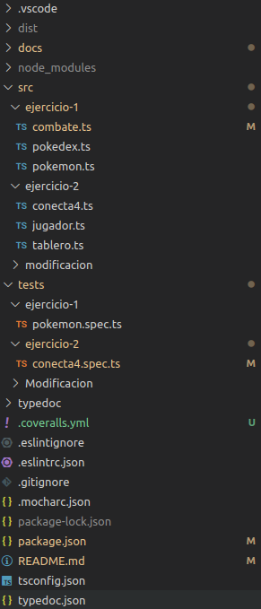

___Imagen 1___

En la `imagen 1` se pueden apreciar los 2 directorios que contendrán el código en TS (cada clase en un archivo diferente), los 2 directorios de pruebas respectivos, los archivos de configuración de cada herramienta, el directorio `typedoc` que contendrá la documentación generada con typedoc...

## Ejercicio 1.

En el `ejercicio 1` se pide desarrollar lo necesario (clases e interfaces) para codificar una `pokedex` que almacene pokemons, codificar `pokemons` los cuales tienen características como nombre, peso, altura, tipo y diferentes estadísticas; y por último codificar una clase `Combat` que simule el combate entre dos pokemons. He desarrollado cada clase en su propio archivo para tenerlo todo mucho más ordenado.

Vamos a empezar por la clase `Pokemon`, este es el código que he realizado:
```typescript
/**
 * @type tipo de dato formado por una tupla de 4 números que almacenaran
 * las estadísticas de los pokemons.
 */
type estadisticasBasicasType = [number, number, number, number];
/**
 * @type tipo de dato formado por una tupla de 4 strings, fuego, hierba,
 * electrico y agua; son los tipos que admitimos para nuestros pokemons.
 */
type tiposType = ("fuego" | "hierba" | "electrico" | "agua");

/**
 * @class Pokemon clase que nos permite instanciar un pokemon con unas
 * características básicas.
 */
export class Pokemon {
  /**
   * ___Método que construye nuestro objeto Pokemon___
   * @param nombre nombre del pokemon.
   * @param peso peso del pokemon.
   * @param altura altura del pokemon.
   * @param tipo tipo del pokemon.
   * @param estadisticasBasicas conjunto de valores que forman las 
   * características de un pokemon.
   */
  constructor(private nombre: string, private peso: number,
              private altura: number, public readonly tipo: tiposType,
              private estadisticasBasicas: estadisticasBasicasType) {
    if (this.nombre === "") {
      console.log("El nombre no puede estar vacío, nombre por defecto UnKonow.");
      this.nombre = "UnKnow";
    }
    if (this.peso < 1) {
      console.log("El valor del peso no puede ser menor a 1, valor por defecto 1");
      this.peso = 1;
    }
    if (this.altura < 1) {
      console.log("El valor del altura no puede ser menor a 1, valor por defecto 1");
      this.altura = 1;
    }
    this.estadisticasBasicas.forEach((element) => {
      if (element < 1) {
        console.log("El valor de las estadísticas no pueden ser menor a 1, valor por defecto 1");
        element = 1;
      }
    });
  }

  /**
   * ___Getter del nombre___
   * @returns el valor del nombre
   */
  getNombre() {
    return this.nombre;
  }

  /**
   * ___Getter del peso___
   * @returns el valor del peso
   */
  getPeso() {
    return this.peso;
  }

  /**
   * ___Getter de la altura___
   * @returns el valor de la altura
   */
  getAltura() {
    return this.altura;
  }

  /**
   * ___Getter de las estadísticas___
   * @returns las estadísticas.
   */
  getEstadisticas() {
    return this.estadisticasBasicas;
  }

  /**
  * ___Método que imprime la informaciónde un pokemon___
  */
  print(): void {
    console.log(`Nombre: ${this.nombre}
Peso: ${this.peso}
Altura: ${this.altura}
Tipo: ${this.tipo}
Estadísticas: Ataque:    ${this.estadisticasBasicas[0]}
              Defensa:   ${this.estadisticasBasicas[1]}
              Velocidad: ${this.estadisticasBasicas[2]}
              Vida:      ${this.estadisticasBasicas[3]}`);
  }
}

```

Lo primero a tener en cuenta es que hay que codificar de forma que todo sea coherente y no tenga fallos, con esto quiero decir que no nos pueden pasar un nombre de un pokemon vacío, una altura negativa ... Por esto mismo los atributos sin ser el tipo del pokemon (que es un tipo de dato especial que solo admite los tipos que en la clase `Combat` se contemplan) son `privados`, para que no puedan ser cambiados. Por lo anteriormente mencionado no he utilizado una interfaz en ninguna de las clases ya que la otra opción era utilizar una interfaz y poner en el constructor `public readonly` pero el problema de esto es que tampoco desde dentro de la clase se puede modificar el atributo, de forma que si nos pasa un atributo erróneo no se puede cambiar.

Como se puede apreciar cada atributo `privado` tiene su `getter` para poder ser accedido desde fuera de la clase, esta clase solo almacena la información de un `pokemon` y tiene un método `print()` que imprime por pantalla los datos del pokemon con un cierto formato. En el constructor se comprueban que todos los datos son correctos y si no es así se cambian a unos por defecto y se informa por pantalla. Gracias a hacer esto tan sólido en la clase `combate` y `pokedex` no pueden ocurrir errores, por ejemplo, si el valor del ataque es menor a 1 le ponemos por defecto 1, de esta forma el combate no se quedaría en un bucle infinito ya que no existe la posibilidad de que un pokemon haga 0 de daño.

En la `imagen 2` se puede ver la salida formateada de la clase `Pokemon`:

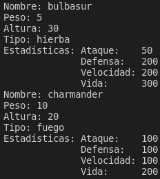

___Imagen 2___

Ahora vamos a revisar la clase `pokedex`. Este es el código que he hecho:
```typescript
import {Pokemon} from "./pokemon";

/**
 * @class Pokedex clase Pokedex que nos permite instanciar una pokedex
 * básica.
 */
export class Pokedex {
  private pokemons: Pokemon[] = [];

  /**
   * ___Método que construye nuesto objeto pokedex___
   * @param pokemonsEntrada conjunto de pokemons que van a formar nuestra 
   * pokedex.
   */
  constructor(...pokemonsEntrada: Pokemon[]) {
    this.pokemons = pokemonsEntrada;
  }

  /**
   * ___Método que busca un pokemon en la pokedex___
   * @param pok pokemon que queremos buscar en nuestra pokedex.
   * @returns true si el pokemon que queremos añadir está en la pokedex
   * false si no lo está.
   */
  private findPokemon(pok: Pokemon) {
    let aux: boolean = false;

    this.pokemons.forEach((element) => {
      if (element === pok) {
        aux = true;
      }
    });
    return aux;
  }

  /**
   * ___Método que añade un pokemon a la pokedex___
   * @param pok pokemon que vamos a añadir a nuestra pokedex.
   * @returns undefined si el pokemon ya se encuentra en la pokedex, void si se
   * ha añadido correctamente.
   */
  addPokemon(pok: Pokemon): boolean {
    if (this.findPokemon(pok)) {
      return false;
    } else {
      this.pokemons.push(pok);
      return true;
    }
  }

  /**
   * ___Método que muestra por pantalla todos los pokemons de la pokedex___
   */
  print(): void {
    console.log("/////////////////////////////");
    console.log("/////////////////////////////");
    this.pokemons.forEach((element) => {
      element.print();
      console.log("/////////////////////////////");
    });
    console.log("/////////////////////////////\n\n\n");
  }
}
```

Metiendonos un poco en el rol de `pokemon` sabemos que una pokedex almacena la información de diferentes pokemons pero no de forma repetida ya que esto sería inútil. Para empezar el constructor recibe un array con diferentes pokemons y de esta forma inicializamos nuestra pokedex. Además le proporcionamos al usuario la capacidad de registrar nuevos pokemos en su pokedex con el método `addPokemon()` (que se apoya en un método privado que busca si el pokemon que se le pase por parámetro se encuentra en la pokedex), para ello miramos primero que el pokemon no se encuentre ya en la pokedex y si no se encuentra se añade. Por otro lado también tenemos un método que imprimen los `pokemons` de nuestra `pokedex` con un cierto formato.

En la `imagen 3` se puede ver la salida formateada de la clase `Pokedex`:

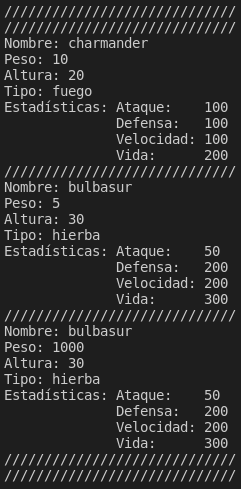

___Imagen 3___

Por último nos queda hablar de la clase `Combat`. Este es el código que he desarrollado:
```typescript
import {Pokemon} from "./pokemon";

/**
 * @class Combat clase Combat que simula el combate entre 2 pokemons.
 */
export class Combat {
  /**
   * ___Método que construye nuestro objeto combat___
   * @param poke1 primer pokemon de nuestro combate.
   * @param poke2 segundo pokemon de nuestro combate.
   */
  constructor(private poke1: Pokemon, private poke2: Pokemon) {}

  /**
   * ___Método que simula el ataque entre dos pokemons___
   * @param miTipo tipo deatacante.
   * @param tipoOpo tipo dedefensor.
   * @param miAtaq ataque deatacante.
   * @param defOpo defensa dedefensor.
   * @returns daño que le ha realizado eatacante al defensor.
   */
  private pokemonBattle(miTipo: string, tipoOpo: string, 
      miAtaq: number, defOpo: number): number {
    const superEfec: number = 2;
    const normal: number = 1;
    const pocoEfec: number = 0.5;
    let damage: number = 50 * (miAtaq / defOpo);
  
    switch (miTipo) {
      case "fuego":
        switch (tipoOpo) {
          case "fuego":
            damage *= pocoEfec;
            break;
          case "agua":
            damage *= pocoEfec;
            break;
          case "hierba":
            damage *= superEfec;
            break;
          case "electrico":
            damage *= normal;
            break;
        }
        break;

      case "agua":
        switch (tipoOpo) {
          case "fuego":
            damage *= superEfec;
            break;
          case "agua":
            damage *= pocoEfec;
            break;
          case "hierba":
            damage *= pocoEfec;
            break;
          case "electrico":
            damage *= pocoEfec;
            break;
        }
        break;

      case "hierba":
        switch (tipoOpo) {
          case "fuego":
            damage *= pocoEfec;
            break;
          case "agua":
            damage *= superEfec;
            break;
          case "hierba":
            damage *= pocoEfec;
            break;
          case "electrico":
            damage *= normal;
            break;
        }
        break;

      case "electrico":
        switch (tipoOpo) {
          case "fuego":
            damage *= normal;
            break;
          case "agua":
            damage *= superEfec;
            break;
          case "hierba":
            damage *= normal;
            break;
          case "electrico":
            damage *= pocoEfec;
            break;
        }
        break;
    }
    return damage;
  }

  /**
   * ___Método que simula el combate entre dos pokemons___
   */
  start(): void | string {
    let aux: number = 0;
    let ataque1: number = 0;
    let ataque2: number = 0;
    let vidaRestante = 0;
    let turno: number = 1;

    while (true) {
      console.log(`Turno ${turno}:`);
      aux = this.pokemonBattle(this.poke1.tipo, this.poke2.tipo, 
          this.poke1.getEstadisticas()[0], this.poke2.getEstadisticas()[1]);

      ataque1 += aux;
      if (this.poke2.getEstadisticas()[3] - ataque1 < 0) {
        vidaRestante = 0;
      } else {
        vidaRestante = this.poke2.getEstadisticas()[3] - ataque1;
      }

      console.log(`${this.poke1.getNombre()} le ha causado ${aux} puntos de daño a ${this.poke2.getNombre()}, a ${this.poke2.getNombre()} le quedan ${vidaRestante} puntos de vida`);

      if (ataque1 >= this.poke2.getEstadisticas()[3]) {
        console.log(`${this.poke2.getNombre()} se ha debilitado`);
        break;
      }

      aux = this.pokemonBattle(this.poke2.tipo, this.poke1.tipo, 
          this.poke2.getEstadisticas()[0], this.poke1.getEstadisticas()[1]);

      ataque2 += aux;
      if (this.poke1.getEstadisticas()[3] - ataque2 < 0) {
        vidaRestante = 0;
      } else {
        vidaRestante = this.poke1.getEstadisticas()[3] - ataque2;
      }

      console.log(`${this.poke2.getNombre()} le ha causado ${aux} puntos de daño a ${this.poke1.getNombre()}, a ${this.poke1.getNombre()} le quedan ${vidaRestante} puntos de vida`);

      if (ataque2 >= this.poke1.getEstadisticas()[3]) {
        console.log(`${this.poke1.getNombre()} se ha debilitado`);
        break;
      }

      turno++;
    }
    if (ataque1 >= this.poke2.getEstadisticas()[3]) {
      console.log(`¡¡¡¡¡${this.poke1.getNombre()} es el ganador !!!!!`);
      return this.poke1.getNombre();
    } else {
      console.log(`¡¡¡¡¡${this.poke2.getNombre()} es el ganador !!!!!`);
      return this.poke2.getNombre();
    }
  }
}
```

La clase `Combat` recibe por parámetro dos pokemons y los almacena para posteriormente simular el combate utilizando el método privado `pokemonBattle()` que se encarga de calcular cuanta vida le quita un pokemon a otro. El método `start()` basicamente consiste en un bucle `while(true)` que para cuando la vida de un pokemon llega a 0 o menos y además va mostrando por pantalla lo que ocurre en el combate. No modificamos directamente la vida de los pokemons que se nos pasó al instanciar el `Objeto Combat` ya que si lo hicieramos no podríamos volver a repetir el combate ya que la vida de alguno de ellos sería 0. Cada iteración del bucle `While(true)` es un turno en el combate.

En la `imagen 4` se puede ver la salida formateada de la clase `Combat`:

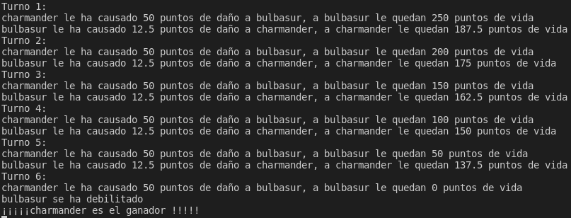

___Imagen 4___

Las pruebas que he realizado las he realizado en un mismo archivo ya que son clases que están relacionadas y además son muy pequeñas, e incluso tienen métodos privados a los cuales no se les puede hacer un `expect()`. El código es el siguiente:
```typescript
import 'mocha';
import {expect} from "chai";
import {Combat} from "../../src/ejercicio-1/combate";
import {Pokedex} from "../../src/ejercicio-1/pokedex";
import {Pokemon} from "../../src/ejercicio-1/pokemon";

const charmander = new Pokemon("charmander", 10, 20, "fuego", 
    [100, 100, 100, 200]);
const bulbasur = new Pokemon("bulbasur", 5, 30, "hierba", 
    [50, 200, 200, 300]);
const bulbasurShiny = new Pokemon("bulbasur", 1000, 3000, "hierba", 
    [50, 200, 200, 300]);

describe('Pokemon class tests', () => {
  it('Un Pokemon no es null', () => {
    expect(charmander).not.to.eql(null);
    expect(bulbasur).not.to.eql(null);
    expect(bulbasurShiny).not.to.eql(null);
  });
  it('Pokemon tiene un atributo nombre', () => {
    expect(charmander.getNombre()).to.eql("charmander");
    expect(bulbasur.getNombre()).to.eql("bulbasur");
    expect(bulbasurShiny.getNombre()).to.eql("bulbasur");
  });
  it('Pokemon tiene un atributo peso', () => {
    expect(charmander.getPeso()).to.eql(10);
    expect(bulbasur.getPeso()).to.eql(5);
    expect(bulbasurShiny.getPeso()).to.eql(1000);
  });
  it('Pokemon tiene un atributo altura', () => {
    expect(charmander.getAltura()).to.eql(20);
    expect(bulbasur.getAltura()).to.eql(30);
    expect(bulbasurShiny.getAltura()).to.eql(3000);
  });
  it('Pokemon tiene un atributo tipo', () => {
    expect(charmander.tipo).to.eql("fuego");
    expect(bulbasur.tipo).to.eql("hierba");
    expect(bulbasurShiny.tipo).to.eql("hierba");
  });
  it('Pokemon tiene un atributo estadísticas', () => {
    expect(charmander.getEstadisticas()).to.eql([100, 100, 100, 200]);
    expect(bulbasur.getEstadisticas()).to.eql([50, 200, 200, 300]);
    expect(bulbasurShiny.getEstadisticas()).to.eql([50, 200, 200, 300]);
  });
});

const poke = new Pokedex(charmander, bulbasur);

describe('Pokedex class tests', () => {
  it('Una Pokedex no es null', () => {
    expect(poke).not.to.eql(null);
  });
  it('Una Pokedex tiene un método para añadir pokemons', () => {
    expect(poke.addPokemon(charmander)).to.eql(false);
    expect(poke.addPokemon(bulbasurShiny)).to.eql(true);
  });
});

const combate = new Combat(charmander, bulbasur);
combate.start();

describe('Combate class tests', () => {
  it('Un combate no es null', () => {
    expect(combate).not.to.eql(null);
  });
  it('Un combate tiene un método para simular una batalla', () => {
    expect(combate.start()).to.eql("charmander");
  });
});
```

En la `imagen 5` se puede apreciar como el código pasa las diferentes pruebas.

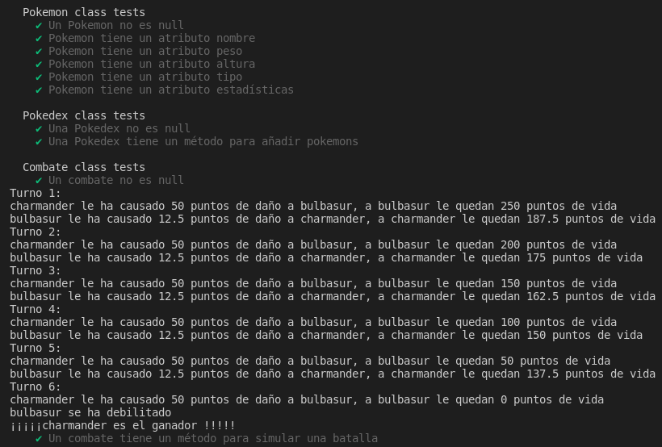

___Imagen 5___

## Ejercicio 2.

En el `ejercicio 2` se pide realizar la codificación de un Conecta4, para ello tenemos que crear diferentes clases, cada una de las clases se encargará de realizar su función, por ejemplo la clase `JugadorConecta4` se encargará de simular el comportamiento de los jugadores(cantidad de fichas, colores de las fichas y nombre del jugador), la clase `TableroConecta4` simula el comportamiento del tablero (coloca las fichas, busca al ganador ...) y por último la clase `Conecta4` une todo para simular lo que es el juego.

Vamos a empezar por la clase `JugadorConecta4`, este es el código que he realizado:
```typescript
export enum ColorFichas {Amarillo = 1, Rojo = 2};
export type fichasType = ColorFichas

/**
 * ___Interfaz de un jugador básico___
 */
interface JugadorBasico {
  nombre: string;
  fichas: number;
  color: fichasType;
}

/**
 * @class JugadorConecta4 clase que simula el comportamiento
 * de un jugador de Conecta 4.
 */
export class JugadorConecta4 implements JugadorBasico {
  /**
   * ___COnstructor de nuestro objeto jugador___
   * @param nombre nombre del jugador
   * @param color color de la ficha del jugador
   * @param fichas cantidad de fichas del jugador.
   */
  constructor(public nombre: string, public color: fichasType, 
      public fichas: number = 21) { 
    if (this.nombre === "") {
      console.log("Valor incorrecto de nombre, por defecto JugadorX");
      this.nombre = "JugadorX";
    }
    if (this.fichas < 1) {
      console.log("Valor incorrecto de fichas, por defecto 21");
      this.fichas = 21;
    }
  }
}
```

Para empezar como el juego `Conecta4` solo tiene fichas rojas y amarillas crearemos un tipo de dato con un `Enum` que solo toma estos dos colores, gracias a hacer esto no pueden pasarnos colores que no existan o podemos controlar si los dos usuarios utilizan las mismas fichas, además como cada valor del `Enum` tiene un valor number propio también lo podremos usar para asignar los valores en el tablero. Vamos a utilizar una interfaz para simular a un jugador básico (jugador que tiene los datos básicos para prácticamente cualquier juego), esta interfaz la implementaremos en nuestra clase `JugadorConecta4` y en el constructor de esta clase comprobaremos que se nos pasa un nombre válido y una cantidad de fichas válidas, en el caso de no ser así le asignaremos nosotros unos valores por defecto.

En la `imagen 6` se puede ver la salida de la clase `JugadorConecta4` cuando le pasamos un nombre y una cantidad de fichas inválidas:

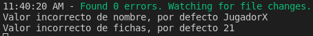

___Imagen 6___

Ahora vamos a hablar de la clase `TableroCOnecta4` que es la más interesante. Este es el código que he desarrollado:
```typescript
/**
 * ___Interfaz de un tablero básico___
 */
interface TableroBasico {
  tablero: number[][];
}

/**
 * @class TableroConecta4 clase que simula el tablero de Conecta 4 con
 * todo lo que ello implica, meter fichas, comprobar quién ha ganado ....
 * 
 */
export class TableroConecta4 implements TableroBasico {
  /**
   * @param tablero Matriz de numeros que simula el tablero
   * @param fichasFila Array de tuplas de [number, number] que
   * cuenta cuantas fichas de cada tipo hay en una fila.
   * @param fichasColumnas Array de tuplas de [number, number] que
   * cuenta cuantas fichas de cada tipo hay en una columna.
   * @param columnaLlena Array de tuplas de number 0 si no se ha llenado
   * 1 si se ha llenado y -1 si está llena y ya se ha revisado.
   * @param filaLlena Array de tuplas de number 0 si no se ha llenado
   * 1 si se ha llenado y -1 si está llena y ya se ha revisado.
   * @param fila Número filas.
   * @param columnas Números de columnas.
   */
  tablero: number[][] = [];

  private fichasFila: [number, number][] = [];
  private fichasColumnas: [number, number][] = [];

  private columnaLlena: number[] = [];
  private filaLlena: number[] = [];

  private fila: number = 6;
  private columnas: number = 7;
  
  /**
   * ___Constructor de la clase que inicializa todos los atributos___
   */
  constructor() {
    let auxTablero: number[] = [];
    for (let f = 0; f < this.fila; f++) {
      for (let c = 0; c < this.columnas; c++) {
        auxTablero.push(0);
      }
      this.tablero.push(auxTablero);
      auxTablero = [];
    }
    
    this.fichasColumnas = [[0, 0], [0, 0], [0, 0], [0, 0], [0, 0], 
      [0, 0], [0, 0]];
    this.fichasFila = [[0, 0], [0, 0], [0, 0], [0, 0], [0, 0], 
      [0, 0]];
    
    this.columnaLlena = [0, 0, 0, 0, 0, 0, 0];
    this.filaLlena = [0, 0, 0, 0, 0, 0];
  }

  /**
   * ___Metodo que imprime las columnas disponibles para insertar fichas___
   */
  columnasDisponibles(): string {
    let aux: string = "";
    console.log("Las columnas libres son:");
    for (let c = 0; c < this.columnas; c++) {
      if (!this.columnaLlena[c]) {
        aux += `${c + 1}` + ", ";
      }
    }
    console.log(aux.substring(0, aux.length - 2));
    return aux.substring(0, aux.length - 2);
  }

  /**
   * ___Método que inserta una ficha en una columna___
   * @param col columna donde se va a insertar la ficha
   * @param valor ficha a insertar.
   * @returns true si la ficha se puede insertar, false si no.
   */
  colocarFicha(col: number, valor: number): boolean {
    if (col > 6 || col < 0) {
      console.log("EL VALOR DE LA COLUMNA ES INCORRECTO");
      return false;
    }
    // Si la columna no está llena.
    if (this.columnaLlena[col] === 0) {
      for (let f = this.fila - 1; f >= 0; f--) {
        // Cuando encontremos un hueco
        if (this.tablero[f][col] === 0) {
          this.tablero[f][col] = valor;
          // Aumentamos el conteo de fichas en la fila y la columna que se insertó.
          if (valor === 1) {
            this.fichasFila[f][0]++;
            this.fichasColumnas[col][0]++;
          } else {
            this.fichasFila[f][1]++;
            this.fichasColumnas[col][1]++;
          }
          
          // Si la columna se llena al insertar la ficha.
          if ((this.fichasColumnas[col][0] + this.fichasColumnas[col][1]) === 6) {
            this.columnaLlena[col] = 1;
          }
          
          // Si la fila se llena al insertar la ficha.
          if ((this.fichasFila[f][0] + this.fichasFila[f][1]) === 7) {
            this.filaLlena[f] = 1;
          }
          break;
        }
      }
      return true;
      // Si en esa columna no se puede insertar la ficha.
    } else {
      console.log("LA COLUMNA ESTÁ LLENA, PRUEBE CON:");
      let aux: string = "";

      // Mostramos las columnas disponibles.
      for (let c = 0; c < this.columnas; c++) {
        if (!this.columnaLlena[c]) {
          aux += `${c + 1}` + ", ";
        }
      }
      console.log(aux.substring(0, aux.length - 2));
      return false;
    }
  }

  /**
   * ___Método que comprueba quién ha ganado___
   * @returns 0 si no se ha encontrado ganador, de lo contario retornla ficha
   * del ganador
   */
  comprobarGanador(): number {
    // Miramos las filas
    for (let f = 0; f < this.fila; f++) {
      // Si hay 4 o más fichas de algún tipo.
      if (this.filaLlena[f] !== -1 && (this.fichasFila[f][0] >= 4 || this.fichasFila[f][1]) >= 4) {
        for (let c = 0; c <= 3; c++) {
          if (this.tablero[f][c] === this.tablero[f][c + 1] && this.tablero[f][c] === 
              this.tablero[f][c + 2] && this.tablero[f][c] === this.tablero[f][c + 3]) {
            return this.tablero[f][c];
          }
        }
      }
      // Si está llena y ya la hemos revisado.
      if (this.filaLlena[f] === 1) {
        // Así no la volvemos a revisar nunca más
        this.filaLlena[f] = -1;
      }
    }

    // Miramos las columnas.
    for (let c = 0; c < this.columnas; c++) {
      // Si hay 4 o más fichas del mismo tipo
      if (this.columnaLlena[c] !== -1 && (this.fichasColumnas[c][0] >= 4 || this.fichasColumnas[c][1]) >= 4) {
        for (let f = 0; f <= 2; f++) {
          if (this.tablero[f][c] === this.tablero[f + 1][c] && this.tablero[f][c] === 
              this.tablero[f + 2][c] && this.tablero[f][c] === this.tablero[f + 3][c]) {
            return this.tablero[f][c];
          }
        }
      }
      // Si está llena y ya la hemos revisado.
      if (this.columnaLlena[c] === 1) {
        // Así no la volvemos a revisar nunca más
        this.columnaLlena[c] = -1;
      }
    }
    let f1 = 2;
    let f2 = 3;
    let c = 0;
    let auxF1 = 0;
    let auxF2 = 0;
    let auxC = 0;

    // Empezamos de izquierda a derecha del tablero a revisar las diagonales.
    while (c !== 4) {
      auxF1 = f1;
      auxF2 = f2;
      auxC = c;

      while (auxF1 <= 2 && auxC <= 3) {
        if (this.tablero[auxF1][auxC] !== 0 && this.tablero[auxF1][auxC] === 
            this.tablero[auxF1 + 1][auxC + 1] && this.tablero[auxF1][auxC] === 
            this.tablero[auxF1 + 2][auxC + 2] && this.tablero[auxF1][auxC] ===
            this.tablero[auxF1 + 3][auxC + 3]) {
          return this.tablero[auxF1][auxC];
        }
        if (this.tablero[auxF2][auxC] !== 0 && this.tablero[auxF2][auxC] === 
            this.tablero[auxF2 - 1][auxC + 1] && this.tablero[auxF2][auxC] === 
            this.tablero[auxF2 - 2][auxC + 2] && this.tablero[auxF2][auxC] ===
            this.tablero[auxF2 - 3][auxC + 3]) {
          return this.tablero[auxF2][auxC];
        }
        auxF2--;
        auxF1++;
        auxC++;
      }
      if (f1 === 0) {
        c++;
      }
      if (f1 > 0) {
        f1--;
      }
      if (f2 < 5) {
        f2++;
      }
    }
    
    return 0;
  }

  /**
   * ___Imprimimos el tablero___
   */
  print() {
    console.log(`
    |${this.tablero[0][0]} ${this.tablero[0][1]} ${this.tablero[0][2]} ${this.tablero[0][3]} ${this.tablero[0][4]} ${this.tablero[0][5]} ${this.tablero[0][6]}|
    |${this.tablero[1][0]} ${this.tablero[1][1]} ${this.tablero[1][2]} ${this.tablero[1][3]} ${this.tablero[1][4]} ${this.tablero[1][5]} ${this.tablero[1][6]}|
    |${this.tablero[2][0]} ${this.tablero[2][1]} ${this.tablero[2][2]} ${this.tablero[2][3]} ${this.tablero[2][4]} ${this.tablero[2][5]} ${this.tablero[2][6]}|
    |${this.tablero[3][0]} ${this.tablero[3][1]} ${this.tablero[3][2]} ${this.tablero[3][3]} ${this.tablero[3][4]} ${this.tablero[3][5]} ${this.tablero[3][6]}|
    |${this.tablero[4][0]} ${this.tablero[4][1]} ${this.tablero[4][2]} ${this.tablero[4][3]} ${this.tablero[4][4]} ${this.tablero[4][5]} ${this.tablero[4][6]}|
    |${this.tablero[5][0]} ${this.tablero[5][1]} ${this.tablero[5][2]} ${this.tablero[5][3]} ${this.tablero[5][4]} ${this.tablero[5][5]} ${this.tablero[5][6]}|
    ---------------\n\n`);
  }
}
```

Esta clase es la más grande ya que básicamente es el corazón del `Conecta4`, para empezar vamos a utilizar una interfaz que lo que tiene es solo un tablero (array de arrays de numbers), ya que el resto de funcionalidades de la clase son propias del `Conecta4`. La gracia de esta clase es poder mirar quién es el `ganador` y `colocar fichas` en las distintas posiciones, partiendo de esto lo podemos hacer de diferentes formas, la más sencilla sería guardar en un Array todas las `posibles soluciones` y cuando algún jugador haya colocado como `mínimo 4 fichas` las recorremos todas y miramos si ha ganado, esta forma no es óptima ya que por cada ficha colocada por un jugador tendremos que recorrer ese array que tiene muchas posibles soluciones. Es por esto que voy a utilizar dos `Arrays de [number, number]`, fichasFila y fichasColumnas, gracias a estos Arrays puedo llevar una `cuenta de cuantas fichas` hay de cada jugador en cada `fila y columna`, de esta forma solo voy a buscar si hay un ganador si existe esa posibilidad, es decir, si en una fila solo hay 3 fichas de cada usuario en esa fila no va a poder haber un ganador entonces esa fila ni la miramos. Por otro lado también voy a utilizar unos `Array de number` para marcar las filas y las columnas que estén llenas, esto lo hago porque no puedo dejar al usuario introducir una ficha en una columna que esté llena y porque si una columna o fila se llena y hay como mínimo 4 fichas de algún jugador miramos si hay un ganador en esa fila o columna y si no lo hay lo marcamos con un `-1` para ya no mirarla nunca más ya que al estar llena no van a entrar fichas nuevas.

Vamos a hablar de los diferentes métodos, empezamos por el `constructor` que se va a encargar de inicializar todos las estructuras que utilizaremos, seguimos con `columnasDisponibles` que devuelve las columnas donde se pueden meter fichas con un cierto formato, `colocarFicha` que es el método que se encarga de colocar las fichas en las columnas que se pueda, además si un jugador coloca una ficha en la fila 1, columna 1 pues en `fichasFila` y en `fichasColumnas` añadiremos que ese jugador ha introducido una ficha en esa fila y en esa columna para de esta forma llevar la cuenta. Luego nos encontramos con el método `comprobarGanador` que comprueba si hay un ganador en las filas y en las columnas siguiendo la lógica que mencioné en el párrafo anterior y además comprueba si hay algún ganador en las diagonales, por último el método `print` que imprime el tablero con un cierto formato, esto lo usaremos para indicarles a los jugadores como se va desarrollando la partida.

En la `imagen 7` se puede ver la salida de la clase `TableroConecta4`:

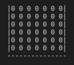

___Imagen 7___

Por último vamos a comentar la clase `Conecta4`. Este es el código que he desarrollado:
```typescript
import {TableroConecta4} from "./tablero";
import {ColorFichas, JugadorConecta4} from "./jugador";

/**
 * @class Conecta4 clase que simula el juego Conecta 4.
 */
export class Conecta4 {
  /**
   * @param tablero tablero del juego.
   */
  private tablero = new TableroConecta4();

  /**
   * ___Constructor de la clase de Conecta 4___
   * @param j1 jugador 1
   * @param j2 jugador 2
   */
  constructor(private j1: JugadorConecta4, private j2: JugadorConecta4) {
    // Si los nombres son iguales.
    if (this.j1.nombre === this.j2.nombre) {
      this.j1.nombre = "Jugador 1";
      this.j2.nombre = "Jugador 2";
      console.log("Los nombres de los jugadores eran iguales y se han cambiado a Jugador 1 y Jugador 2");
    }

    // SI usan las mismas fichas.
    if (this.j1.color === this.j2.color) {
      console.log(`Los jugadores no pueden jugar con las mismas fichas`);
      if (this.j1.color === 1) {
        this.j1.color = ColorFichas.Rojo;
      } else {
        this.j1.color = ColorFichas.Amarillo;
      }
      console.log(`Ahora las fichas de ${this.j1.nombre} son de color ${ColorFichas[this.j1.color]}`);
    }
    // Si tienen la cantidad de fichas incorrecta.
    if (this.j1.fichas !== 21) {
      this.j1.fichas = 21;
      console.log(`${this.j1.nombre} tenía la cantidad incorrecta de fichas, ahora tiene 21`);
    }
    if (this.j2.fichas !== 21) {
      this.j2.fichas = 21;
      console.log(`${this.j2.nombre} tenía la cantidad incorrecta de fichas, ahora tiene 21`);
    }
  }

  /**
   * ___Método que inicializa la partida___
   */
  start(modo: boolean = false): string {
    console.log("");
    let fichas1 = this.j1.fichas;
    let fichas2 = this.j2.fichas;

    const readlineSync = require('readline-sync');
    let lectura: string = "";

    console.log("El estado actual del tablero es:");
    this.tablero.print();

    // Hasta que no se queden sin fichas.
    while (fichas1 > 0 || fichas2 > 0) {
      // Turno del jugador 1
      console.log(`-----Es el turno del jugador ${this.j1.nombre}-----`);
      console.log("Elija donde colocar la ficha");
      this.tablero.columnasDisponibles();

      // Tiene que introducir una columna valida
      if (modo) {
        do {
          lectura = readlineSync.question("");
        } while (!this.tablero.colocarFicha(parseInt(lectura) - 1, this.j1.color));
      } else {
        this.tablero.colocarFicha(1, this.j1.color);
      }

      fichas1--;

      console.log("El estado actual del tablero es:");
      this.tablero.print();

      // Miramos si J1 ha ganado.
      if (this.tablero.comprobarGanador() !== 0) {
        console.log(`¡¡¡¡¡¡¡¡¡¡Felicidade ${this.j1.nombre} has ganado!!!!!!!!!!`);
        return `¡¡¡¡¡¡¡¡¡¡Felicidade ${this.j1.nombre} has ganado!!!!!!!!!!`;
      }

      // Turno del jugador 1
      console.log(`Es el turno del jugador ${this.j2.nombre}`);
      console.log("Elija donde colocar la ficha");
      this.tablero.columnasDisponibles();

      // Tiene que introducir una columna valida
      if (modo) {
        do {
          lectura = readlineSync.question("");
        } while (!this.tablero.colocarFicha(parseInt(lectura) - 1, this.j2.color));
      } else {
        this.tablero.colocarFicha(2, this.j2.color);
      }
      fichas2--;

      console.log("El estado actual del tablero es:");
      this.tablero.print();

      // Miramos si J2 ha ganado.
      if (this.tablero.comprobarGanador() !== 0) {
        console.log(`¡¡¡¡¡¡¡¡¡¡Felicidade ${this.j2.nombre} has ganado!!!!!!!!!!`);
        return `¡¡¡¡¡¡¡¡¡¡Felicidade ${this.j2.nombre} has ganado!!!!!!!!!!`;
      }
    }
    // Si han quedado en empate.
    console.log("¡¡¡La partida ha quedado en empate, bien jugado!!!");
    return "¡¡¡La partida ha quedado en empate, bien jugado!!!";
  }
}
```

Esta clase tiene un `atributo privado` que es el `tablero` y `recibe dos atributos privados` que son los jugadores, además en el constructor comprueba que los nombres de los jugadores son diferentes para poder diferenciarlos y también mira que no utilicen las mismas fichas. Solo tiene un método, `start`, que se encarga de inicializar el juego y no termina hasta que haya un ganador o la partida quede en empate. Básicamente en `start` empieza jugando el primer jugador que recibe el constructor, este pone ficha en una columna válida, miramos si ha ganado y luego repetimos con el jugador 2 y volvemos a repetir hasta que se acabe la partida. `start` tiene un `boolean` que por defecto es false, este boolean activa el modo automático por defecto y si le pasas un true activa el modo que requiere interacción de los jugadores, esto lo hacemos para poder realizar pruebas.

En la `imagen 8` y en la `imagen 9` se puede ver la salida de la clase `Conecta4`, para las pruebas del conecta 4 y el ejemplo de las imagenes `imagen 8` e `imagen 9` se les ha asignado valores por defectos y no lee de teclado, ya que como no es un método que siempre tenga el mismo comportamiento no podemos determinar una salida estándar ya que depende de la jugada de los jugadores.:

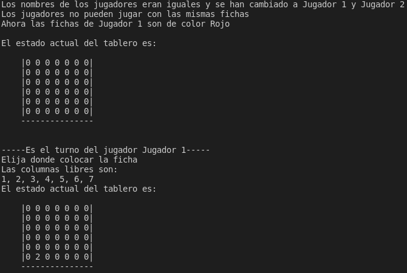

___Imagen 8___

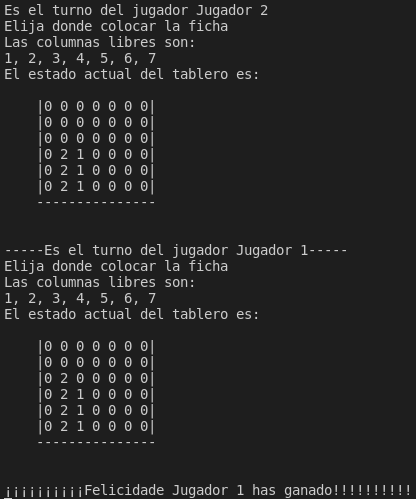

___Imagen 9___

Las pruebas que he realizado las he realizado en un mismo archivo ya que son clases que están relacionadas y además no son muy grandes. El código es el siguiente:
```typescript
import 'mocha';
import {expect} from "chai";
import {Conecta4} from "../../src/ejercicio-2/conecta4";
import {ColorFichas, JugadorConecta4} from "../../src/ejercicio-2/jugador";
import {TableroConecta4} from "../../src/ejercicio-2/tablero";

const tablero = new TableroConecta4();

describe('TableroConecta4 class tests', () => {
  it('Un tablero no es null', () => {
    expect(tablero).not.to.eql(null);
  });
  it('Un tablero tiene un atributo que representa un tablero', () => {
    expect(tablero.tablero).not.to.eql(null);
  });
  it('Un tablero tiene un metodo para mostrar las columnas libres', () => {
    expect(tablero.columnasDisponibles()).to.eql("1, 2, 3, 4, 5, 6, 7");
  });
  it('Un tablero tiene un metodo para colocar ficha', () => {
    expect(tablero.colocarFicha(10, 1)).to.eql(false);
    expect(tablero.colocarFicha(-2, 1)).to.eql(false);
    expect(tablero.colocarFicha(1, 1)).to.eql(true);
  });
  it('Un tablero tiene un metodo para comprobar el ganador', () => {
    expect(tablero.comprobarGanador()).to.eql(0);
  });
});

const jugador = new JugadorConecta4("Pepe", ColorFichas.Amarillo);

describe('JugadorConecta4 class tests', () => {
  it('Un Jugador no es null', () => {
    expect(jugador).not.to.eql(null);
  });
});

const jugador2 = new JugadorConecta4("Raul", ColorFichas.Rojo);

const juego = new Conecta4(jugador, jugador2);

describe('Conecta4 class tests', () => {
  it('Un Conecta4 no es null', () => {
    expect(juego).not.to.eql(null);
  });
  it('Un Conecta4 tiene un método que simula una partida y dar un ganador', () => {
    expect(juego.start()).to.eql("¡¡¡¡¡¡¡¡¡¡Felicidade Pepe has ganado!!!!!!!!!!");
  });
});
```

En la `imagen 10` y en la `imagen 11` se puede apreciar como el código pasa las diferentes pruebas.

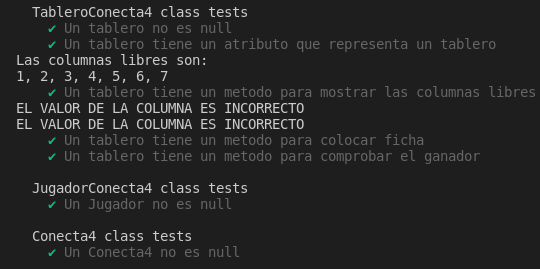

___Imagen 10___

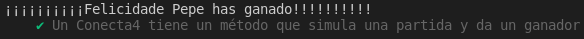

___Imagen 11___

## Coveralls

En esta práctica también hemos utilizado la herramienta `Coverrals` como se puede apreciar en las imagenes 11 y 12, para ello hemos puesto el repositorio de manera temporal público y luego lo hemos vuelto a poner privado.

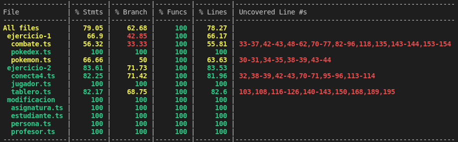

___Imagen 12___

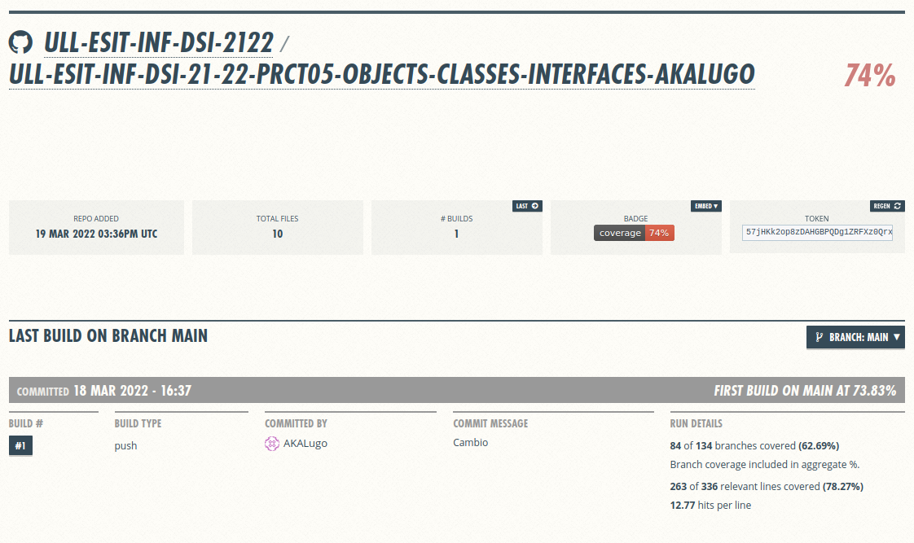

___Imagen 13___