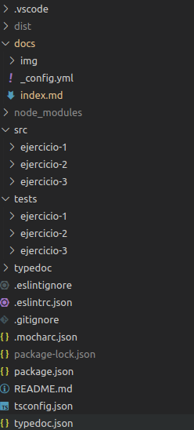
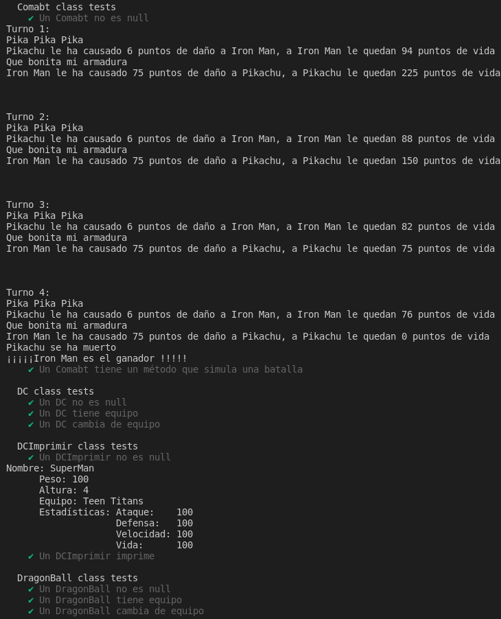
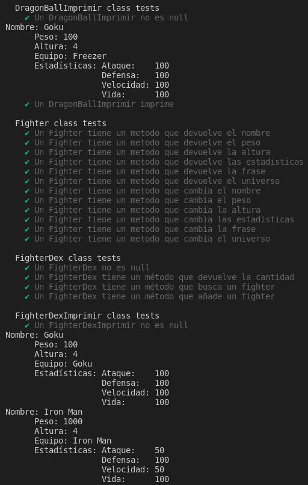
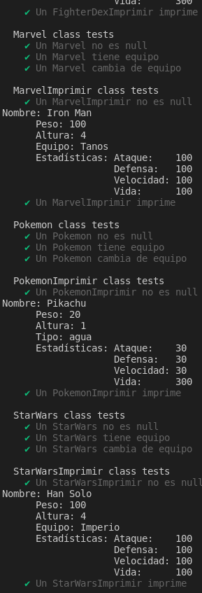
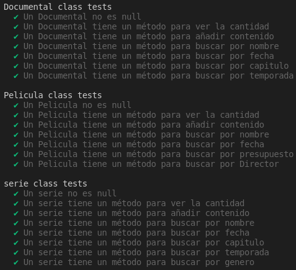
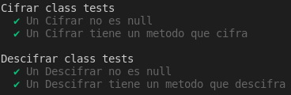
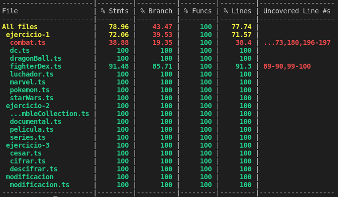

## Introducción
En esta práctica realizaremos 3 ejercicios en TypeScript para prácticar los `principios SOLID`, además crearemos el directorio adecuado para desarrollar proyectos en TS y utilizaremos herramientas como `EsLint` para el estilo del código según `Google` en nuestro caso, `TypeDoc` para la generación de la documentación del código de nuestro proyecto, `Mocha` y `Chai` para la creación de pruebas que nos permitiran llevar acabo el desarrollo `TDD` y por último `Coverall`.

## Primeros pasos
Lo primero que tendremos que hacer es ver todos los vídeos tutoriales que se encuentran en el aula virtual para poder instalar todas las herramientas nombradas previamente. A continuación nos leeremos los apuntes sobre los [principios SOLID](https://ull-esit-inf-dsi-2122.github.io/typescript-theory/typescript-solid.html) ya que necesitaremos esos conocimientos para poder realizar la práctica.

Una vez hecho todo lo anterior podemos empezar a codificar en TypeScript. El directorio de nuestro proyecto quedaría tal que así:



___Imagen 1___

En la `imagen 1` se pueden apreciar los 3 directorios que contendrán el código en TS (cada clase en un archivo diferente), los 3 directorios de pruebas respectivos, los archivos de configuración de cada herramienta, el directorio `typedoc` que contendrá la documentación generada con typedoc...

## Ejercicio 1.
En el `ejercicio 1` se nos pide mejorar el ejercicio 1 de la práctica 5, de manera que ahora no solo peleen pokemons sino también personajes de otros universos, además tendremos que tener una `FighterDex` para alamcenarlos. Se nos pide que sigamos los principios SOLID y en especial los principios `Single Responsability y Open-Closed`, que consisten en que cada clase se encarga de una única función y que no se cambian las clases de otros programadores para añadir funcionalidades sino que heredamos de ella y le añadimos funcionalidades en una clase nueva. Este es el código que he desarrollado en TS:

___combat.ts___
```typescript
import {DC} from "./dc";
import {DragonBall} from "./dragonBall";
import {Fighter} from "./luchador";
import {Marvel} from "./marvel";
import {Pokemon} from "./pokemon";

/**
 * @class Clase que simula un combate
 */
export class Combat {
  /**
   * Constructor de la clase Comabt.
   * @param fighter1 luchador 1
   * @param fighter2 luchador 2
   */
  constructor(private fighter1: Fighter, private fighter2: Fighter) {}
  
  /**
   * Método que calcula cuanta vida le quita un luchador a otro.
   * @param f1 luchador 1
   * @param f2 luchador 2
   * @returns La vida que le quita el luchador 1 al luchador 2.
   */
  private figtherBattle(f1: Fighter, f2: Fighter): number {
    console.log(f1.getFrase());
    
    let damage: number = 0;
    const atacante = f1;
    const defensor = f2;

    if (f1 instanceof Pokemon) {
      if (f2 instanceof Pokemon) {
        const superEfec: number = 2;
        const normal: number = 1;
        const pocoEfec: number = 0.5;
        damage = 50 * (f1.getEstadisticas()[0] / f1.getEstadisticas()[1]);
        switch (f1.getTipo()) {
          case "fuego":
            switch (f2.getTipo()) {
              case "fuego":
                damage *= pocoEfec;
                break;
              case "agua":
                damage *= pocoEfec;
                break;
              case "hierba":
                damage *= superEfec;
                break;
              case "electrico":
                damage *= normal;
                break;
            }
            break;
  
          case "agua":
            switch (f2.getTipo()) {
              case "fuego":
                damage *= superEfec;
                break;
              case "agua":
                damage *= pocoEfec;
                break;
              case "hierba":
                damage *= pocoEfec;
                break;
              case "electrico":
                damage *= pocoEfec;
                break;
            }
            break;
  
          case "hierba":
            switch (f2.getTipo()) {
              case "fuego":
                damage *= pocoEfec;
                break;
              case "agua":
                damage *= superEfec;
                break;
              case "hierba":
                damage *= pocoEfec;
                break;
              case "electrico":
                damage *= normal;
                break;
            }
            break;
  
          case "electrico":
            switch (f2.getTipo()) {
              case "fuego":
                damage *= normal;
                break;
              case "agua":
                damage *= superEfec;
                break;
              case "hierba":
                damage *= normal;
                break;
              case "electrico":
                damage *= pocoEfec;
                break;
            }
            break;
        }
        return damage;
      } else if (f2 instanceof Marvel) {
        return f1.getEstadisticas()[0] / 5;
      } else if (f2 instanceof DC) {
        return f1.getEstadisticas()[0] / 4;
      } else if (f2 instanceof DragonBall) {
        return f1.getEstadisticas()[0] / 1000;
      } else {
        return f1.getEstadisticas()[0] * 2 / f2.getEstadisticas()[1];
      }
    } else if (f1 instanceof Marvel) {
      if (f2 instanceof Pokemon) {
        return f1.getEstadisticas()[0] * 1.5;
      } else if (f2 instanceof DC) {
        return f1.getEstadisticas()[0] / f2.getEstadisticas()[1];
      } else if (f2 instanceof DragonBall) {
        return f1.getEstadisticas()[0] / 10;
      } else if (f2 instanceof Marvel) {
        return f1.getEstadisticas()[0];
      } else {
        return f1.getEstadisticas()[0] / f2.getEstadisticas()[1];
      }
    } else if (f1 instanceof DC) {
      if (f2 instanceof Pokemon) {
        return f1.getEstadisticas()[0] * 1.5;
      } else if (f2 instanceof DC) {
        return f1.getEstadisticas()[0] / f2.getEstadisticas()[1];
      } else if (f2 instanceof DragonBall) {
        return f1.getEstadisticas()[0] / 10;
      } else if (f2 instanceof Marvel) {
        return f1.getEstadisticas()[0];
      } else {
        return f1.getEstadisticas()[0] / f2.getEstadisticas()[1];
      }
    } else if (f1 instanceof DragonBall) {
      return 1000;
    } else {
      return f1.getEstadisticas()[0] * 10;
    }
  }
  
  /**
   * Método que inicia la pelea.
   * @returns Granador del combate
   */
  start(): void | string {
    let aux: number = 0;
    let ataque1: number = 0;
    let ataque2: number = 0;
    let vidaRestante = 0;
    let turno: number = 1;
  
    while (true) {
      console.log(`Turno ${turno}:`);
      aux = this.figtherBattle(this.fighter1, this.fighter2);
  
      ataque1 += aux;
      if (this.fighter2.getEstadisticas()[3] - ataque1 < 0) {
        vidaRestante = 0;
      } else {
        vidaRestante = this.fighter2.getEstadisticas()[3] - ataque1;
      }
  
      console.log(`${this.fighter1.getNombre()} le ha causado ${aux} puntos de daño a ${this.fighter2.getNombre()}, a ${this.fighter2.getNombre()} le quedan ${vidaRestante} puntos de vida`);
  
      if (ataque1 >= this.fighter2.getEstadisticas()[3]) {
        console.log(`${this.fighter2.getNombre()} se ha muerto`);
        break;
      }
  
      aux = this.figtherBattle(this.fighter2, this.fighter1);
  
      ataque2 += aux;
      if (this.fighter1.getEstadisticas()[3] - ataque2 < 0) {
        vidaRestante = 0;
      } else {
        vidaRestante = this.fighter1.getEstadisticas()[3] - ataque2;
      }
  
      console.log(`${this.fighter2.getNombre()} le ha causado ${aux} puntos de daño a ${this.fighter1.getNombre()}, a ${this.fighter1.getNombre()} le quedan ${vidaRestante} puntos de vida`);
  
      if (ataque2 >= this.fighter1.getEstadisticas()[3]) {
        console.log(`${this.fighter1.getNombre()} se ha muerto`);
        break;
      }
  
      console.log("\n\n");
      turno++;
    }
    if (ataque1 >= this.fighter2.getEstadisticas()[3]) {
      console.log(`¡¡¡¡¡${this.fighter1.getNombre()} es el ganador !!!!!`);
      return this.fighter1.getNombre();
    } else {
      console.log(`¡¡¡¡¡${this.fighter2.getNombre()} es el ganador !!!!!`);
      return this.fighter2.getNombre();
    }
  }
}
```

___dc.ts___
```typescript
import {estadisticasBasicasType, universoType, Fighter} from "./luchador";

/**
 * @type tipo para los equipos.
 */
export type dcTeamType = ("Teen Titans" | "Rogues" | "Liga de la justicia");

/**
 * @class Clase Dc
 */
export class DC extends Fighter {
  /**
   * Constructor de la clase
   * @param nombre Nombre del luchador
   * @param peso Peso del luchador
   * @param altura Altura del luchador
   * @param estadisticasBasicas estadisticas del luchador
   * @param frase Frase del luchador
   * @param universo Universo del luchador
   * @param equipo Equipo del luchador.
   */
  constructor(nombre: string, peso: number, altura: number,
      estadisticasBasicas: estadisticasBasicasType, frase: string, 
      universo: universoType, private equipo: dcTeamType) {
    super(nombre, peso, altura, estadisticasBasicas, frase, universo);
  }

  /**
   * get del equipo
   * @returns El quipo
   */
  getEquipo(): dcTeamType {
    return this.equipo;
  }

  /**
   * set del equipo
   * @param equipo equipo nuevo
   */
  setEquipo(equipo: dcTeamType): void {
    this.equipo = equipo;
  }
}

/**
 * @class Clase que imprime DC.
 */
export class DCImprimir {
  /**
   * Constructor de la clase
   * @param objeto Objeto DC
   */
  constructor(private objeto: DC) {}
  
  /**
   * Método que imprime el objeto
   * @returns el objeto en texto
   */
  print(): string {
    console.log(`Nombre: ${this.objeto.getNombre()}
      Peso: ${this.objeto.getPeso()}
      Altura: ${this.objeto.getAltura()}
      Equipo: ${this.objeto.getEquipo()}
      Estadísticas: Ataque:    ${this.objeto.getEstadisticas()[0]}
                    Defensa:   ${this.objeto.getEstadisticas()[1]}
                    Velocidad: ${this.objeto.getEstadisticas()[2]}
                    Vida:      ${this.objeto.getEstadisticas()[3]}`);
                    
    let salida: string = `Nombre: ${this.objeto.getNombre()} Peso: ${this.objeto.getPeso()} Altura: ${this.objeto.getAltura()} `;
    salida += `Equipo: ${this.objeto.getEquipo()} Estadísticas: Ataque: ${this.objeto.getEstadisticas()[0]} `;
    salida += `Defensa: ${this.objeto.getEstadisticas()[1]} Velocidad: ${this.objeto.getEstadisticas()[2]} `;
    salida += `Vida: ${this.objeto.getEstadisticas()[3]} `;
  
    return salida;
  }
}
```

___dragonBall.ts___
```typescript
import {estadisticasBasicasType, universoType, Fighter} from "./luchador";

/**
 * @type tipo para los equipos.
 */
export type dragonBallTeamType = ("Goku" | "Freezer");

/**
 * @class Clase DragonBall
 */
export class DragonBall extends Fighter {
  /**
   * Constructor de la clase
   * @param nombre Nombre del luchador
   * @param peso Peso del luchador
   * @param altura Altura del luchador
   * @param estadisticasBasicas estadisticas del luchador
   * @param frase Frase del luchador
   * @param universo Universo del luchador
   * @param equipo Equipo del luchador.
   */
  constructor(nombre: string, peso: number, altura: number,
      estadisticasBasicas: estadisticasBasicasType, frase: string, 
      universo: universoType, private equipo: dragonBallTeamType) {
    super(nombre, peso, altura, estadisticasBasicas, frase, universo);
  }

  /**
   * get del equipo
   * @returns El quipo
   */
  getEquipo(): dragonBallTeamType {
    return this.equipo;
  }

  /**
   * set del equipo
   * @param equipo equipo nuevo
   */
  setEquipo(equipo: dragonBallTeamType): void {
    this.equipo = equipo;
  }
}

/**
 * @class Clase DragonBallImprimir
 */
export class DragonBallImprimir {
  /**
   * Constructor de la clase
   * @param objeto Objeto DragonBall
   */
  constructor(private objeto: DragonBall) {}

  /**
   * Método que imprime el objeto
   * @returns el objeto en texto
   */
  print(): string {
    console.log(`Nombre: ${this.objeto.getNombre()}
      Peso: ${this.objeto.getPeso()}
      Altura: ${this.objeto.getAltura()}
      Equipo: ${this.objeto.getEquipo()}
      Estadísticas: Ataque:    ${this.objeto.getEstadisticas()[0]}
                    Defensa:   ${this.objeto.getEstadisticas()[1]}
                    Velocidad: ${this.objeto.getEstadisticas()[2]}
                    Vida:      ${this.objeto.getEstadisticas()[3]}`);
                    
    let salida: string = `Nombre: ${this.objeto.getNombre()} Peso: ${this.objeto.getPeso()} Altura: ${this.objeto.getAltura()} `;
    salida += `Equipo: ${this.objeto.getEquipo()} Estadísticas: Ataque: ${this.objeto.getEstadisticas()[0]} `;
    salida += `Defensa: ${this.objeto.getEstadisticas()[1]} Velocidad: ${this.objeto.getEstadisticas()[2]} `;
    salida += `Vida: ${this.objeto.getEstadisticas()[3]} `;
  
    return salida;
  }
}
```

___fighterDex.ts___
```typescript
import {DC, DCImprimir} from "./dc";
import {DragonBall, DragonBallImprimir} from "./dragonBall";
import {Fighter} from "./luchador";
import {Marvel, MarvelImprimir} from "./marvel";
import {Pokemon, PokemonImprimir} from "./pokemon";
import {StarWars, StarWarsImprimir} from "./starWars";

/**
 * @class Clase FighterDex
 */
export class FighterDex {
  private almacen: Fighter[] = [];
  constructor(...almacen: Fighter[]) {
    this.almacen = almacen;
  }

  /**
   * Get del número de luchadores.
   * @returns Número de luchadores
   */
  getNumberOfFigthers(): number {
    return this.almacen.length;
  }

  /**
   * Get luchador.
   * @param index Posición
   * @returns Luchador
   */
  getFigther(index: number) {
    return this.almacen[index];
  }

  /**
   * Busca a un luchador
   * @param luchador luchador
   * @returns true si está, false si no.
   */
  private findFighter(luchador: Fighter): boolean {
    let aux: boolean = false;

    this.almacen.forEach((element) => {
      if (element === luchador) {
        aux = true;
      }
    });
    return aux;
  }

  /**
   * Añade a un luchador.
   * @param luchador Luchador
   * @returns true si se añadió, false si no.
   */
  addFighter(luchador: Fighter): boolean {
    if (this.findFighter(luchador)) {
      return false;
    } else {
      this.almacen.push(luchador);
      return true;
    }
  }
}

/**
 * @class Clase FighterDexImprimir.
 */
export class FighterDexImprimir {
  /**
   * Constructor.
   * @param figthers fighterDex
   */
  constructor(private figthers: FighterDex) {}

  /**
   * Método que imprime a los luchadores.
   * @returns Los luchadores como texto
   */
  print(): string {
    let salida: string = "";
    for (let i = 0; i < this.figthers.getNumberOfFigthers(); i++) {
      const obj = this.figthers.getFigther(i);
      if (obj instanceof Marvel) {
        const aux = new MarvelImprimir(obj);
        salida += aux.print() + "\n";
      }

      if (obj instanceof DC) {
        const aux = new DCImprimir(obj);
        salida += aux.print() + "\n";
      }

      if (obj instanceof DragonBall) {
        const aux = new DragonBallImprimir(obj);
        salida += aux.print() + "\n";
      }

      if (obj instanceof StarWars) {
        const aux = new StarWarsImprimir(obj);
        salida += aux.print() + "\n";
      }

      if (obj instanceof Pokemon) {
        const aux = new PokemonImprimir(obj);
        salida += aux.print() + "\n";
      } 
    }

    return salida;
  }
}
```

___luchador.ts___
```typescript
/**
 * @type estadísticas.
 */
export type estadisticasBasicasType = [number, number, number, number];

/**
 * @type universos.
 */
export type universoType = ("Pokemon" | "Marvel" | "DC" | "Star Wars" | "Dragon Ball");

/**
 * @class Clase abstracta fighter.
 */
export abstract class Fighter {
  /**
   * Constructor de la clase
   * @param nombre Nombre del luchador
   * @param peso Peso del luchador
   * @param altura Altura del luchador
   * @param estadisticasBasicas estadisticas del luchador
   * @param frase Frase del luchador
   * @param universo Universo del luchador
   */
  constructor(private nombre: string, private peso: number,
      private altura: number, private estadisticasBasicas: 
      estadisticasBasicasType, private frase: string, private universo:
      universoType) {
    if (this.nombre === "") {
      console.log("El nombre no puede estar vacío, nombre por defecto UnKnow.");
      this.nombre = "UnKnow";
    }
    if (this.peso < 1) {
      console.log("El valor del peso no puede ser menor a 1, valor por defecto 1");
      this.peso = 1;
    }
    if (this.altura < 1) {
      console.log("El valor del altura no puede ser menor a 1, valor por defecto 1");
      this.altura = 1;
    }
    if (this.frase === "") {
      console.log("La frase no puede estar vacía, valor por defecto UnKnow");
      this.frase = "UnKnow";
    }
    this.estadisticasBasicas.forEach((element) => {
      if (element < 1) {
        console.log("El valor de las estadísticas no pueden ser menor a 1, valor por defecto 1");
        element = 1;
      }
    });
  }

  /**
   * ___Getter del nombre___
   * @returns el valor del nombre
   */
  getNombre(): string {
    return this.nombre;
  }

  /**
   * ___Getter del peso___
   * @returns el valor del peso
   */
  getPeso(): number {
    return this.peso;
  }

  /**
   * ___Getter de la altura___
   * @returns el valor de la altura
   */
  getAltura(): number {
    return this.altura;
  }

  /**
   * ___Getter de las estadísticas___
   * @returns las estadísticas.
   */
  getEstadisticas(): estadisticasBasicasType {
    return this.estadisticasBasicas;
  }

  /**
   * Get de la frase
   * @returns la frase
   */
  getFrase(): string {
    return this.frase;
  }

  /**
   * Get del universo
   * @returns el universo
   */
  getUniverso(): string {
    return this.universo;
  }

  /**
   * Set del nombre
   * @param nombre nuevo nombre
   */
  setNombre(nombre: string): void {
    this.nombre = nombre;
  }

  /**
   * Set de la altura.
   * @param altura nueva altura
   */
  setAltura(altura: number): void {
    this.altura = altura;
  }

  /**
   * Set del peso
   * @param peso nuevo peso
   */
  setPeso(peso: number): void {
    this.peso = peso;
  }

  /**
   * Set estadísticas.
   * @param estadisticas nuevas estadísticas
   */
  setEstadisticas(estadisticas: estadisticasBasicasType): void {
    this.estadisticasBasicas = estadisticas;
  }

  /**
   * Set universo.
   * @param universo Nuevo universo
   */
  setUniverso(universo: universoType): void {
    this.universo = universo;
  }

  /**
   * Set frase.
   * @param frase nueva frase
   */
  setFrase(frase: string): void {
    this.frase = frase;
  }
}
```

___marvel.ts___
```typescript
import {estadisticasBasicasType, universoType, Fighter} from "./luchador";

/**
 * @type tipo para los equipos.
 */
export type marvelTeamType = ("Iron Man" | "Tanos");

/**
 * @class Clase Marvel
 */
export class Marvel extends Fighter {
  /**
   * Constructor de la clase
   * @param nombre Nombre del luchador
   * @param peso Peso del luchador
   * @param altura Altura del luchador
   * @param estadisticasBasicas estadisticas del luchador
   * @param frase Frase del luchador
   * @param universo Universo del luchador
   * @param equipo Equipo del luchador.
   */
  constructor(nombre: string, peso: number, altura: number,
      estadisticasBasicas: estadisticasBasicasType, frase: string, 
      universo: universoType, private equipo: marvelTeamType) {
    super(nombre, peso, altura, estadisticasBasicas, frase, universo);
  }

  /**
   * get del equipo
   * @returns El quipo
   */
  getEquipo(): marvelTeamType {
    return this.equipo;
  }

  /**
   * set del equipo
   * @param equipo equipo nuevo
   */
  setEquipo(equipo: marvelTeamType): void {
    this.equipo = equipo;
  }
}

/**
 * @class clase Marvel Imprimir.
 */
export class MarvelImprimir {
  /**
   * Constructor de la clase
   * @param objeto Objeto Marvel
   */
  constructor(private objeto: Marvel) {}

  /**
   * Método que imprime el objeto
   * @returns el objeto en texto
   */
  print(): string {
    console.log(`Nombre: ${this.objeto.getNombre()}
      Peso: ${this.objeto.getPeso()}
      Altura: ${this.objeto.getAltura()}
      Equipo: ${this.objeto.getEquipo()}
      Estadísticas: Ataque:    ${this.objeto.getEstadisticas()[0]}
                    Defensa:   ${this.objeto.getEstadisticas()[1]}
                    Velocidad: ${this.objeto.getEstadisticas()[2]}
                    Vida:      ${this.objeto.getEstadisticas()[3]}`);
                  
    let salida: string = `Nombre: ${this.objeto.getNombre()} Peso: ${this.objeto.getPeso()} Altura: ${this.objeto.getAltura()} `;
    salida += `Equipo: ${this.objeto.getEquipo()} Estadísticas: Ataque: ${this.objeto.getEstadisticas()[0]} `;
    salida += `Defensa: ${this.objeto.getEstadisticas()[1]} Velocidad: ${this.objeto.getEstadisticas()[2]} `;
    salida += `Vida: ${this.objeto.getEstadisticas()[3]} `;

    return salida;
  }
}
```

___pokemon.ts___
```typescript
import {estadisticasBasicasType, universoType, Fighter} from "./luchador";

/**
 * @type tipo de dato formado por una tupla de 4 strings, fuego, hierba,
 * electrico y agua; son los tipos que admitimos para nuestros pokemons.
 */
 type tiposType = ("fuego" | "hierba" | "electrico" | "agua");

/**
 * @class clase Pokemon.
 */
export class Pokemon extends Fighter {
  /**
   * Constructor de la clase
   * @param nombre Nombre del luchador
   * @param peso Peso del luchador
   * @param altura Altura del luchador
   * @param estadisticasBasicas estadisticas del luchador
   * @param frase Frase del luchador
   * @param universo Universo del luchador
   * @param equipo Equipo del luchador.
   */
  constructor(nombre: string, peso: number, altura: number,
      estadisticasBasicas: estadisticasBasicasType, frase: string, 
      universo: universoType, private tipo: tiposType) {
    super(nombre, peso, altura, estadisticasBasicas, frase, universo);
  }

  /**
   * get del equipo
   * @returns El quipo
   */
  getTipo(): tiposType {
    return this.tipo;
  }

  /**
   * set del equipo
   * @param equipo equipo nuevo
   */
  setTipo(tipo: tiposType): void {
    this.tipo = tipo;
  }
}

/**
 * @class Clase PokemonImprimir.
 */
export class PokemonImprimir {
  /**
   * Constructor de la clase
   * @param objeto Objeto Pokemon
   */
  constructor(private objeto: Pokemon) {}
  
  /**
   * Método que imprime el objeto
   * @returns el objeto en texto
   */
  print(): string {
    console.log(`Nombre: ${this.objeto.getNombre()}
      Peso: ${this.objeto.getPeso()}
      Altura: ${this.objeto.getAltura()}
      Tipo: ${this.objeto.getTipo()}
      Estadísticas: Ataque:    ${this.objeto.getEstadisticas()[0]}
                    Defensa:   ${this.objeto.getEstadisticas()[1]}
                    Velocidad: ${this.objeto.getEstadisticas()[2]}
                    Vida:      ${this.objeto.getEstadisticas()[3]}`);
                    
    let salida: string = `Nombre: ${this.objeto.getNombre()} Peso: ${this.objeto.getPeso()} Altura: ${this.objeto.getAltura()} `;
    salida += `Equipo: ${this.objeto.getTipo()} Estadísticas: Ataque: ${this.objeto.getEstadisticas()[0]} `;
    salida += `Defensa: ${this.objeto.getEstadisticas()[1]} Velocidad: ${this.objeto.getEstadisticas()[2]} `;
    salida += `Vida: ${this.objeto.getEstadisticas()[3]} `;
  
    return salida;
  }
}
```

___starWars.ts___
```typescript
import {estadisticasBasicasType, universoType, Fighter} from "./luchador";

/**
 * @type tipo para los equipos.
 */
export type starWarsTeamType = ("Rebeldes" | "Imperio");

/**
 * @class Clase StarWars.
 */
export class StarWars extends Fighter {
  /**
   * Constructor de la clase
   * @param nombre Nombre del luchador
   * @param peso Peso del luchador
   * @param altura Altura del luchador
   * @param estadisticasBasicas estadisticas del luchador
   * @param frase Frase del luchador
   * @param universo Universo del luchador
   * @param equipo Equipo del luchador.
   */
  constructor(nombre: string, peso: number, altura: number,
      estadisticasBasicas: estadisticasBasicasType, frase: string, 
      universo: universoType, private equipo: starWarsTeamType) {
    super(nombre, peso, altura, estadisticasBasicas, frase, universo);
  }

  /**
   * get del equipo
   * @returns El quipo
   */
  getEquipo(): starWarsTeamType {
    return this.equipo;
  }

  /**
   * set del equipo
   * @param equipo equipo nuevo
   */
  setEquipo(equipo: starWarsTeamType): void {
    this.equipo = equipo;
  }
}

/**
 * @class Clase StarWarsImprimir
 */
export class StarWarsImprimir {
  /**
   * Constructor de la clase
   * @param objeto Objeto StarWars
   */
  constructor(private objeto: StarWars) {}
  
  /**
   * Método que imprime el objeto
   * @returns el objeto en texto
   */
  print(): string {
    console.log(`Nombre: ${this.objeto.getNombre()}
      Peso: ${this.objeto.getPeso()}
      Altura: ${this.objeto.getAltura()}
      Equipo: ${this.objeto.getEquipo()}
      Estadísticas: Ataque:    ${this.objeto.getEstadisticas()[0]}
                    Defensa:   ${this.objeto.getEstadisticas()[1]}
                    Velocidad: ${this.objeto.getEstadisticas()[2]}
                    Vida:      ${this.objeto.getEstadisticas()[3]}`);
                    
    let salida: string = `Nombre: ${this.objeto.getNombre()} Peso: ${this.objeto.getPeso()} Altura: ${this.objeto.getAltura()} `;
    salida += `Equipo: ${this.objeto.getEquipo()} Estadísticas: Ataque: ${this.objeto.getEstadisticas()[0]} `;
    salida += `Defensa: ${this.objeto.getEstadisticas()[1]} Velocidad: ${this.objeto.getEstadisticas()[2]} `;
    salida += `Vida: ${this.objeto.getEstadisticas()[3]} `;
  
    return salida;
  }
}
```

Partimos de que tenemos una clase `Fighter` que es una clase abstracta de la cual van a heredar el resto de clases de luchadores y esta clase contiene la base para que un personaje sea un luchador. Luego hemos desarrollado cada clase luchador añadiendole a cada una un atributo `equipo` donde cada clase trandra a sus equipos característicos, además hemos creado para cada clase luchador una clase que imprima a ese luchador con un cierto formato, apoyandonos en el principio `Single Responsability`.

Por otro lado tenemos la clase `FighterDex` que se encarga de alamcenar a los luchadores y se apoya en otra clase para imprimir a los luchadores almacenados. Por último tenemos la clase `Combat` que se encarga de recibir dos luchadores (objetos de la clase Fighter ya que es la clase que tienen en común todas las clases) y de simular el combate, esta clase utiliza un método que según de la clase que sean los luchadores se efectuará un daño u otro.

Estas son las pruebas que he realizado para comprobar el correcto funcionamiento del código:

___combat.spec.ts___
```typescript
import 'mocha';
import {expect} from "chai";
import {Combat} from "../../src/ejercicio-1/combat";
import {Marvel} from '../../src/ejercicio-1/marvel';
import {Pokemon} from '../../src/ejercicio-1/pokemon';

const IronMan = new Marvel("Iron Man", 1000, 4, [50, 100, 50, 100], "Que bonita mi armadura", "Marvel", "Iron Man");
const pikachu = new Pokemon("Pikachu", 20, 1, [30, 30, 30, 300], "Pika Pika Pika", "Pokemon", "electrico");

const combate = new Combat(pikachu, IronMan);

describe('Comabt class tests', () => {
  it('Un Comabt no es null', () => {
    expect(combate).not.to.eql(null);
  });
  it('Un Comabt tiene un método que simula una batalla', () => {
    expect(combate.start()).to.eql("Iron Man");
  });
});
```

___dc.spec.ts___
```typescript
import 'mocha';
import {expect} from "chai";
import {DC, DCImprimir} from "../../src/ejercicio-1/dc";

const superMan = new DC("SuperMan", 100, 4, [100, 100, 100, 100], "Soy SuperMan", "DC", "Liga de la justicia");
const superManImprimir = new DCImprimir(superMan);

describe('DC class tests', () => {
  it('Un DC no es null', () => {
    expect(superMan).not.to.eql(null);
  });
  it('Un DC tiene equipo', () => {
    expect(superMan.getEquipo()).to.eql("Liga de la justicia");
  });
  it('Un DC cambia de equipo', () => {
    superMan.setEquipo("Teen Titans");
    expect(superMan.getEquipo()).to.eql("Teen Titans");
  });
});

describe('DCImprimir class tests', () => {
  it('Un DCImprimir no es null', () => {
    expect(superManImprimir).not.to.eql(null);
  });
  it('Un DCImprimir imprime', () => {
    expect(superManImprimir.print()).to.eql("Nombre: SuperMan Peso: 100 Altura: 4 Equipo: Teen Titans Estadísticas: Ataque: 100 Defensa: 100 Velocidad: 100 Vida: 100 ");
  });
});
```

___dragonBall.spec.ts___
```typescript
import 'mocha';
import {expect} from "chai";
import {DragonBall, DragonBallImprimir} from "../../src/ejercicio-1/dragonBall";

const goku = new DragonBall("Goku", 100, 4, [100, 100, 100, 100], "Me pican los cocos", "Dragon Ball", "Goku");
const gokuImprimir = new DragonBallImprimir(goku);

describe('DragonBall class tests', () => {
  it('Un DragonBall no es null', () => {
    expect(goku).not.to.eql(null);
  });
  it('Un DragonBall tiene equipo', () => {
    expect(goku.getEquipo()).to.eql("Goku");
  });
  it('Un DragonBall cambia de equipo', () => {
    goku.setEquipo("Freezer");
    expect(goku.getEquipo()).to.eql("Freezer");
  });
});

describe('DragonBallImprimir class tests', () => {
  it('Un DragonBallImprimir no es null', () => {
    expect(gokuImprimir).not.to.eql(null);
  });
  it('Un DragonBallImprimir imprime', () => {
    expect(gokuImprimir.print()).to.eql("Nombre: Goku Peso: 100 Altura: 4 Equipo: Freezer Estadísticas: Ataque: 100 Defensa: 100 Velocidad: 100 Vida: 100 ");
  });
});
```

___fighter.spec.ts___
```typescript
import 'mocha';
import {expect} from "chai";
import {DragonBall, DragonBallImprimir} from "../../src/ejercicio-1/dragonBall";

const goku = new DragonBall("Goku", 100, 4, [100, 100, 100, 100], "Me pican los cocos", "Dragon Ball", "Goku");
const gokuFake = new DragonBall("", -1, -1, [-1, -1, -1, -1], "", "Dragon Ball", "Goku");

describe('Fighter class tests', () => {
  it('Un Fighter tiene un metodo que devuelve el nombre', () => {
    expect(goku.getNombre()).to.eql("Goku");
    expect(gokuFake.getNombre()).to.eql("UnKnow");
  });
  it('Un Fighter tiene un metodo que devuelve el peso', () => {
    expect(goku.getPeso()).to.eql(100);
    expect(gokuFake.getPeso()).to.eql(1);
  });
  it('Un Fighter tiene un metodo que devuelve la altura', () => {
    expect(goku.getAltura()).to.eql(4);
    expect(gokuFake.getAltura()).to.eql(1);
  });
  it('Un Fighter tiene un metodo que devuelve las estadisticas', () => {
    expect(goku.getEstadisticas()).to.eql([100, 100, 100, 100]);
  });
  it('Un Fighter tiene un metodo que devuelve la frase', () => {
    expect(goku.getFrase()).to.eql("Me pican los cocos");
  });
  it('Un Fighter tiene un metodo que devuelve el universo', () => {
    expect(goku.getUniverso()).to.eql("Dragon Ball");
  });

  it('Un Fighter tiene un metodo que cambia el nombre', () => {
    goku.setNombre("Pepe");
    expect(goku.getNombre()).to.eql("Pepe");
  });
  it('Un Fighter tiene un metodo que cambia el peso', () => {
    goku.setPeso(200);
    expect(goku.getPeso()).to.eql(200);
  });
  it('Un Fighter tiene un metodo que cambia la altura', () => {
    goku.setAltura(5);
    expect(goku.getAltura()).to.eql(5);
  });
  it('Un Fighter tiene un metodo que cambia las estadisticas', () => {
    goku.setEstadisticas([200, 200, 200, 200]);
    expect(goku.getEstadisticas()).to.eql([200, 200, 200, 200]);
  });
  it('Un Fighter tiene un metodo que cambia la frase', () => {
    goku.setFrase("Hola bby");
    expect(goku.getFrase()).to.eql("Hola bby");
  });
  it('Un Fighter tiene un metodo que cambia el universo', () => {
    goku.setUniverso("Marvel");
    expect(goku.getUniverso()).to.eql("Marvel");
  });
});
```

___fighterDex.spec.ts___
```typescript
import 'mocha';
import {expect} from "chai";
import {FighterDex, FighterDexImprimir} from "../../src/ejercicio-1/fighterDex";
import {DragonBall} from '../../src/ejercicio-1/dragonBall';
import {Marvel} from '../../src/ejercicio-1/marvel';
import {Pokemon} from '../../src/ejercicio-1/pokemon';

const goku = new DragonBall("Goku", 100, 4, [100, 100, 100, 100], "Me pican los cocos", "Dragon Ball", "Goku");
const IronMan = new Marvel("Iron Man", 1000, 4, [50, 100, 50, 100], "Que bonita mi armadura", "Marvel", "Iron Man");
const pikachu = new Pokemon("Pikachu", 20, 1, [30, 30, 30, 300], "Pika Pika Pika", "Pokemon", "electrico");

const dex = new FighterDex(goku, IronMan);
const imprimirdex = new FighterDexImprimir(dex);

describe('FighterDex class tests', () => {
  it('Un FighterDex no es null', () => {
    expect(dex).not.to.eql(null);
  });
  it('Un FighterDex tiene un método que devuelve la cantidad', () => {
    expect(dex.getNumberOfFigthers()).to.eql(2);
  });
  it('Un FighterDex tiene un método que busca un fighter', () => {
    expect(dex.getFigther(0)).to.eql(goku);
  });
  it('Un FighterDex tiene un método que añade un fighter', () => {
    expect(dex.addFighter(pikachu)).to.eql(true);
    expect(dex.addFighter(pikachu)).to.eql(false);
  });
});

let salidaDex: string = "Nombre: Goku Peso: 100 Altura: 4 Equipo: Goku Estadísticas: Ataque: 100 Defensa: 100 Velocidad: 100 Vida: 100 \n" +
                    "Nombre: Iron Man Peso: 1000 Altura: 4 Equipo: Iron Man Estadísticas: Ataque: 50 Defensa: 100 Velocidad: 50 Vida: 100 \n" +
                    "Nombre: Pikachu Peso: 20 Altura: 1 Equipo: electrico Estadísticas: Ataque: 30 Defensa: 30 Velocidad: 30 Vida: 300 \n"

describe('FighterDexImprimir class tests', () => {
  it('Un FighterDexImprimir no es null', () => {
    expect(imprimirdex).not.to.eql(null);
  });
  it('Un FighterDexImprimir imprime', () => {
    expect(imprimirdex.print()).to.eql(salidaDex);
  });
});
```

___marvel.spec.ts___
```typescript
import 'mocha';
import {expect} from "chai";
import {Marvel, MarvelImprimir} from "../../src/ejercicio-1/marvel";

const ironMan = new Marvel("Iron Man", 100, 4, [100, 100, 100, 100], "Soy Iron Man", "Marvel", "Iron Man");
const ironManImprimir = new MarvelImprimir(ironMan);

describe('Marvel class tests', () => {
  it('Un Marvel no es null', () => {
    expect(ironMan).not.to.eql(null);
  });
  it('Un Marvel tiene equipo', () => {
    expect(ironMan.getEquipo()).to.eql("Iron Man");
  });
  it('Un Marvel cambia de equipo', () => {
    ironMan.setEquipo("Tanos");
    expect(ironMan.getEquipo()).to.eql("Tanos");
  });
});

describe('MarvelImprimir class tests', () => {
  it('Un MarvelImprimir no es null', () => {
    expect(ironManImprimir).not.to.eql(null);
  });
  it('Un MarvelImprimir imprime', () => {
    expect(ironManImprimir.print()).to.eql("Nombre: Iron Man Peso: 100 Altura: 4 Equipo: Tanos Estadísticas: Ataque: 100 Defensa: 100 Velocidad: 100 Vida: 100 ");
  });
});
```

___pokemon.spec.ts___
```typescript
import 'mocha';
import {expect} from "chai";
import {Pokemon, PokemonImprimir} from "../../src/ejercicio-1/pokemon";

const pikachu = new Pokemon("Pikachu", 20, 1, [30, 30, 30, 300], "Pika Pika Pika", "Pokemon", "electrico");
const pikachuImprimir = new PokemonImprimir(pikachu);

describe('Pokemon class tests', () => {
  it('Un Pokemon no es null', () => {
    expect(pikachu).not.to.eql(null);
  });
  it('Un Pokemon tiene equipo', () => {
    expect(pikachu.getTipo()).to.eql("electrico");
  });
  it('Un Pokemon cambia de equipo', () => {
    pikachu.setTipo("agua");
    expect(pikachu.getTipo()).to.eql("agua");
  });
});

describe('PokemonImprimir class tests', () => {
  it('Un PokemonImprimir no es null', () => {
    expect(pikachuImprimir).not.to.eql(null);
  });
  it('Un PokemonImprimir imprime', () => {
    expect(pikachuImprimir.print()).to.eql("Nombre: Pikachu Peso: 20 Altura: 1 Equipo: agua Estadísticas: Ataque: 30 Defensa: 30 Velocidad: 30 Vida: 300 ");
  });
});
```

___starWars.spec.ts___
```typescript
import 'mocha';
import {expect} from "chai";
import {StarWars, StarWarsImprimir} from "../../src/ejercicio-1/starWars";

const hanSolo = new StarWars("Han Solo", 100, 4, [100, 100, 100, 100], "Mi nave está guapa", "Star Wars", "Rebeldes");
const hanSoloImprimir = new StarWarsImprimir(hanSolo);

describe('StarWars class tests', () => {
  it('Un StarWars no es null', () => {
    expect(hanSolo).not.to.eql(null);
  });
  it('Un StarWars tiene equipo', () => {
    expect(hanSolo.getEquipo()).to.eql("Rebeldes");
  });
  it('Un StarWars cambia de equipo', () => {
    hanSolo.setEquipo("Imperio");
    expect(hanSolo.getEquipo()).to.eql("Imperio");
  });
});

describe('StarWarsImprimir class tests', () => {
  it('Un StarWarsImprimir no es null', () => {
    expect(hanSoloImprimir).not.to.eql(null);
  });
  it('Un StarWarsImprimir imprime', () => {
    expect(hanSoloImprimir.print()).to.eql("Nombre: Han Solo Peso: 100 Altura: 4 Equipo: Imperio Estadísticas: Ataque: 100 Defensa: 100 Velocidad: 100 Vida: 100 ");
  });
});
```

En la `imagen 2, 3 y 4` se puede apreciar como el código pasa las diferentes pruebas.



___Imagen 2___



___Imagen 3___



___Imagen 4___

## Ejercicio 2
En el `ejercicio 2` se nos pide desarrollar diferentes clases he interfaces para simular el modelo de datos de una paltaforma de vídeo de streaming. Para ello hay que definir interfaces genéricas y una clase abstracta que será la base de las clases que representarán los distintios formatos de vídeo y audio de la plataforma. Sobretodo se nos pide desarrollar el `principio SOLID Interface segregation` que consiste dividir interfaces muy complejas en varias más sencillas. Este es el código que he desarrollado en TS:

___BasicStreambleCollection.ts___
```typescript
/**
 * @interface Streamable contiene un alamcen.
 */
interface Streamable<T> {
  almacen: T[];
}

/**
 * @interface StreamableAdd contiene un metodo que añade.
 */
interface StreamableAdd<T> {
  addContenido(item: T): boolean;
}

/**
 * @interface StreamableGetData contiene dos getters.
 */
interface StreamableGetData<T> {
  getContenidoPorNombre(nombre: string): T[];
  getContenidoPorFecha(fecha: string): T[];
}

/**
 * @interface StreamableNumber contiene un getter.
 */
interface StreamableNumber {
  getNumeroItems(): number;
}

/**
 * @class Clase BasicStreamableCollection<T>
 */
export abstract class BasicStreamableCollection<T> implements Streamable<T>, StreamableAdd<T>, StreamableGetData<T>, StreamableNumber {
  /**
   * Constructor.
   * @param almacen almacen de los datos
   */
  constructor(public readonly almacen: T[]) {}

  /**
   * Get numero de datos.
   * @returns numero de datos
   */
  getNumeroItems(): number {
    return this.almacen.length;
  }

  /**
   * Método que añade contenido.
   * @param item item que se va a añadir
   * @returns true si se añade.
   */
  addContenido(item: T): boolean {
    this.almacen.push(item);
    return true;
  }

  /**
   * Método que busca contenido por el nombre.
   * @param nombre nombre a buscar.
   */
  abstract getContenidoPorNombre(nombre: string): T[];
  /**
   * Método que busca por la fecha.
   * @param fecha fecha a buscar
   */
  abstract getContenidoPorFecha(fecha: string): T[];
}
```

___documental.ts___
```typescript
import {BasicStreamableCollection} from "./BasicStreambleCollection";

/**
 * @type datos del documental
 */
export type documentalType = {
  nombre: string; 
  fecha: string;
  capitulo: number;
  temporada: number
};

/**
 * @class Documental
 */
export class Documental extends BasicStreamableCollection<documentalType> {
  constructor(...data: documentalType[]) {
    super(data);
  }

  /**
   * Get según un nombre.
   * @param nombre nombre a buscar
   * @returns Documental
   */
  getContenidoPorNombre(nombre: string): documentalType[] {
    return this.almacen.filter((item) => item.nombre === nombre);
  }

  /**
   * Get según una fecha.
   * @param fecha fecha a buscar
   * @returns Documental
   */
  getContenidoPorFecha(fecha: string): documentalType[] {
    return this.almacen.filter((item) => item.fecha === fecha);
  }

  /**
   * Get según un capitulo
   * @param capitulo capitulo a buscar
   * @returns Documental
   */
  getContenidoPorCapitulo(capitulo: number): documentalType[] {
    return this.almacen.filter((item) => item.capitulo === capitulo);
  }

  /**
   * Get según una temporada
   * @param temporada temporada a buscar
   * @returns Documental
   */
  getContenidoPorTemporada(temporada: number): documentalType[] {
    return this.almacen.filter((item) => item.temporada === temporada);
  }
}
```

___pelicula.ts___
```typescript
import {BasicStreamableCollection} from "./BasicStreambleCollection";

/**
 * @type Datos de las peliculas
 */
export type peliculaType = {
  nombre: string;
  fecha: string;
  presupuesto: number;
  director: string;
};

/**
 * @class Pelicula
 */
export class Pelicula extends BasicStreamableCollection<peliculaType> {
  constructor(...data: peliculaType[]) {
    super(data);
  }

  /**
   * Get según un nombre.
   * @param nombre nombre a buscar
   * @returns Peliculas
   */
  getContenidoPorNombre(nombre: string): peliculaType[] {
    return this.almacen.filter((item) => item.nombre === nombre);
  }

  /**
   * Get según una fecha.
   * @param fecha fecha a buscar
   * @returns Peliculas
   */
  getContenidoPorFecha(fecha: string): peliculaType[] {
    return this.almacen.filter((item) => item.fecha === fecha);
  }

  /**
   * Get según un presupuesto
   * @param presupuesto presupuesto a buscar
   * @returns Peliculas
   */
  getContenidoPorPresupuesto(presupuesto: number): peliculaType[] {
    return this.almacen.filter((item) => item.presupuesto === presupuesto);
  }

  /**
   * Get según un director
   * @param director director a buscar
   * @returns Peliculas
   */
  getContenidoPorDirector(director: string): peliculaType[] {
    return this.almacen.filter((item) => item.director === director);
  }
}
```

___serie.ts___
```typescript
import {BasicStreamableCollection} from "./BasicStreambleCollection";

/**
 * @type Datos de las series.
 */
export type serieType = {
  titulo: string;
  fecha: string;
  genero: string;
  capitulo: number;
  temporada: number
};

/**
 * @class Serie
 */
export class Serie extends BasicStreamableCollection<serieType> {
  /**
   * constructor.
   * @param data alamcen de datos
   */
  constructor(...data: serieType[]) {
    super(data);
  }

  /**
   * Get según un nombre.
   * @param nombre nombre a buscar
   * @returns Series.
   */
  getContenidoPorNombre(nombre: string): serieType[] {
    return this.almacen.filter((item) => item.titulo === nombre);
  }

  /**
   * Get según una fecha.
   * @param fecha fecha a buscar
   * @returns Series
   */
  getContenidoPorFecha(fecha: string): serieType[] {
    return this.almacen.filter((item) => item.fecha === fecha);
  }

  /**
   * Get según un género
   * @param genero genero a buscar
   * @returns Series
   */
  getContenidoPorGenero(genero: string): serieType[] {
    return this.almacen.filter((item) => item.genero === genero);
  }

  /**
   * Get según un capítulo.
   * @param capitulo capitulo a buscar
   * @returns Series
   */
  getContenidoPorCapitulo(capitulo: number): serieType[] {
    return this.almacen.filter((item) => item.capitulo === capitulo);
  }

  /**
   * Get según una temporada.
   * @param temporada temporada a buscar
   * @returns Series
   */
  getContenidoPorTemporada(temporada: number): serieType[] {
    return this.almacen.filter((item) => item.temporada === temporada);
  }
}
```

Partimos del fichero `BasicStreambleCollection.ts` que contiene diferentes interfaces genéricas que luego se implementaran en la clase abstracta genérica `BasicStreamableCollection`, este clase tiene 2 métodos, uno para añadir contenido y otro para devolver el número de contenidos además tiene 2 métodos abstractos `getContenidoPorNombre` y `getContenidoPorFecha` que serán métodos desarrollados por las clases hijas. Por otro lado tenemos las clases `Pelicula`, `Serie` y `Documental` que son clases que heredan de la clase abstracta anteriormente mencionada, estas clases utilizan cada una un tipo de dato especial para poder guardar sus atributos y añaden más métodos de filtrado de contenido.

Estas son las pruebas que he realizado en TS:

___documental.spec.ts___
```typescript
import 'mocha';
import {expect} from "chai";
import {Documental, documentalType} from "../../src/ejercicio-2/documental";

let patos: documentalType = {
  nombre: "Patos",
  fecha: "11-11-11",
  capitulo: 30,
  temporada: 2,
}

let gatos: documentalType = {
  nombre: "Gatos",
  fecha: "10-10-01",
  capitulo: 10,
  temporada: 2,
}

let perros: documentalType = {
  nombre: "Perros",
  fecha: "01-02-03",
  capitulo: 5,
  temporada: 3,
}

const documental = new Documental(patos, gatos);

describe('Documental class tests', () => {
  it('Un Documental no es null', () => {
    expect(documental).not.to.eql(null);
  });
  it('Un Documental tiene un método para ver la cantidad', () => {
    expect(documental.getNumeroItems()).to.eql(2);
  });
  it('Un Documental tiene un método para añadir contenido', () => {
    expect(documental.addContenido(perros)).to.eql(true);
  });
  it('Un Documental tiene un método para buscar por nombre', () => {
    expect(documental.getContenidoPorNombre("Perros")).to.eql([perros]);
  });
  it('Un Documental tiene un método para buscar por fecha', () => {
    expect(documental.getContenidoPorFecha("11-11-11")).to.eql([patos]);
  });
  it('Un Documental tiene un método para buscar por capitulo', () => {
    expect(documental.getContenidoPorCapitulo(10)).to.eql([gatos]);
  });
  it('Un Documental tiene un método para buscar por temporada', () => {
    expect(documental.getContenidoPorTemporada(3)).to.eql([perros]);
  });
});
```

___pelicula.spec.ts___
```typescript
import 'mocha';
import {expect} from "chai";
import {Pelicula, peliculaType} from "../../src/ejercicio-2/pelicula";

let patos: peliculaType = {
  nombre: "Patos",
  fecha: "11-11-11",
  presupuesto: 30,
  director: "Pepe",
}

let gatos: peliculaType = {
  nombre: "Gatos",
  fecha: "10-10-01",
  presupuesto: 10,
  director: "Ramon",
}

let perros: peliculaType = {
  nombre: "Perros",
  fecha: "01-02-03",
  presupuesto: 5,
  director: "Pepe",
}

const pelicula = new Pelicula(patos, gatos);

describe('Pelicula class tests', () => {
  it('Un Pelicula no es null', () => {
    expect(pelicula).not.to.eql(null);
  });
  it('Un Pelicula tiene un método para ver la cantidad', () => {
    expect(pelicula.getNumeroItems()).to.eql(2);
  });
  it('Un Pelicula tiene un método para añadir contenido', () => {
    expect(pelicula.addContenido(perros)).to.eql(true);
  });
  it('Un Pelicula tiene un método para buscar por nombre', () => {
    expect(pelicula.getContenidoPorNombre("Perros")).to.eql([perros]);
  });
  it('Un Pelicula tiene un método para buscar por fecha', () => {
    expect(pelicula.getContenidoPorFecha("11-11-11")).to.eql([patos]);
  });
  it('Un Pelicula tiene un método para buscar por presupuesto', () => {
    expect(pelicula.getContenidoPorPresupuesto(10)).to.eql([gatos]);
  });
  it('Un Pelicula tiene un método para buscar por Director', () => {
    expect(pelicula.getContenidoPorDirector("Pepe")).to.eql([patos, perros]);
  });
});
```

___serie.spec.ts___
```typescript
import 'mocha';
import {expect} from "chai";
import {Serie, serieType} from "../../src/ejercicio-2/series";

let patos: serieType = {
  titulo: "Patos",
  fecha: "11-11-11",
  genero: "anime",
  capitulo: 30,
  temporada: 2,
}

let gatos: serieType = {
  titulo: "Gatos",
  fecha: "10-10-01",
  genero: "aventura",
  capitulo: 10,
  temporada: 2,
}

let perros: serieType = {
  titulo: "Perros",
  fecha: "01-02-03",
  genero: "arcade",
  capitulo: 5,
  temporada: 3,
}

const serie = new Serie(patos, gatos);

describe('serie class tests', () => {
  it('Un serie no es null', () => {
    expect(serie).not.to.eql(null);
  });
  it('Un serie tiene un método para ver la cantidad', () => {
    expect(serie.getNumeroItems()).to.eql(2);
  });
  it('Un serie tiene un método para añadir contenido', () => {
    expect(serie.addContenido(perros)).to.eql(true);
  });
  it('Un serie tiene un método para buscar por nombre', () => {
    expect(serie.getContenidoPorNombre("Perros")).to.eql([perros]);
  });
  it('Un serie tiene un método para buscar por fecha', () => {
    expect(serie.getContenidoPorFecha("11-11-11")).to.eql([patos]);
  });
  it('Un serie tiene un método para buscar por capitulo', () => {
    expect(serie.getContenidoPorCapitulo(10)).to.eql([gatos]);
  });
  it('Un serie tiene un método para buscar por temporada', () => {
    expect(serie.getContenidoPorTemporada(3)).to.eql([perros]);
  });
  it('Un serie tiene un método para buscar por genero', () => {
    expect(serie.getContenidoPorGenero("anime")).to.eql([patos]);
  });
});
```

En la `imagen 5` se puede apreciar como el código pasa las diferentes pruebas.



___Imagen 5___

## Ejercicio 3
En el `ejercicio 3` nos piden desarrollar un Cifrado César modificado, que cifrará un `string` según una clave, esto lo hace desplazando cada letra del `string` original según la letra correspondiente de la clave. Se nos pide que seguimos los `Principios SOLID` en general, para ello hemos desarrollado una clase abstracta que nos servirá de base para luego implementar 2 clases, la clase que cifra y la que descifra; la clase aabstracta implementa varias interfaces sencillas. Este es el código que he realizado para este ejercicio:

___cesar.ts___
```typescript
/**
 * @interface Alfabeto contiene un string
 */
interface Alfabeto {
  alfabeto: string;
}

/**
 * @interface Clave contiene un string
 */
interface Clave {
  clave: string;
}

/**
 * @interface Mensaje contiene un string
 */
interface Mensaje {
  mensaje: string;
}

/**
 * @interface CifradoCesar contiene un método que ejecuta una operación
 */
interface CifradoCesar {
  operacion(): string;
}

/**
 * @class Cesar
 */
export abstract class Cesar implements Alfabeto, Clave, Mensaje, CifradoCesar {
  /**
   * Cosntructor
   * @param alfabeto alfabeto
   * @param clave clave
   * @param mensaje mensaje
   */
  constructor(public readonly alfabeto: string, public clave: string,
      public readonly mensaje: string) {
    while (this.clave.length < this.mensaje.length) {
      this.clave += this.clave;
    }
  }

  /**
   * Método que realiza una operación y devuelve el resultado
   * en un string.
   */
  abstract operacion(): string;
}
```

___cifrar.ts___
```typescript
import {Cesar} from "./cesar";

/**
 * @class Cifrar
 */
export class Cifrar extends Cesar {
  /**
   * Cosntructor
   * @param alfabeto alfabeto
   * @param clave clave
   * @param mensaje mensaje
   */
  constructor(alfabeto: string, clave: string, mensaje: string) {
    super(alfabeto, clave, mensaje);
  }

  /**
   * Método que cifra
   * @returns El resultado en formato texto
   */
  operacion(): string {
    let salida: string = "";

    for (let recorrido = 0; recorrido < this.mensaje.length; recorrido++) {
      if (this.alfabeto.indexOf(this.mensaje[recorrido]) === -1) {
        salida += this.mensaje[recorrido];
      } else {
        salida += this.alfabeto[(this.alfabeto.indexOf(this.mensaje[recorrido]) +
                  this.alfabeto.indexOf(this.clave[recorrido])) % this.alfabeto.length];
      }
    }

    return salida;
  }
}
```

___descifrar.ts___
```typescript
import {Cesar} from "./cesar";

/**
 * @class Descifrar
 */
export class Descifrar extends Cesar {
  /**
   * Cosntructor
   * @param alfabeto alfabeto
   * @param clave clave
   * @param mensaje mensaje
   */
  constructor(alfabeto: string, clave: string, mensaje: string) {
    super(alfabeto, clave, mensaje);
  }

  /**
   * Método que descifra
   * @returns El resultado en formato texto
   */
  operacion(): string {
    let salida: string = "";
    let aux: number = 0;

    for (let recorrido = 0; recorrido < this.mensaje.length; recorrido++) {
      if (this.alfabeto.indexOf(this.mensaje[recorrido]) === -1) {
        salida += this.mensaje[recorrido];
      } else {
        aux = this.alfabeto.indexOf(this.mensaje[recorrido]) - this.alfabeto.indexOf(this.clave[recorrido]);
        if (aux < 0) {
          aux = this.alfabeto.length + aux;
        }
        salida += this.alfabeto[aux];
      }
    }

    return salida;
  }
}
```

Para cifrar calculamos donde se encuentra la letra del mensaje en el abecedario, luego hacemos lo mismo para la clave y las sumamos realizando el módulo con el tamaño del abecedario para no salirnos. Para descifrar calculamos donde se encuentra la letra del mensaje cifrado en el abecedario y le restamos la posición de la letra correspondiente de la clave, si la resta da un valor menor a 0 se lo restamos al tamaño del abecedario. Para realizar estos cifrados y descifrados como mínimo la clave tiene que ser del tamaño del mensaje, es por esto que en el cosntructor de la clase abstracta repetimos tantas veces la clave como sea necesario para que como mínimo mida lo mismo.

Estas son las pruebas que he desarrollado:

```typescript
import 'mocha';
import {expect} from "chai";
import {Cifrar} from "../../src/ejercicio-3/cifrar";
import {Descifrar} from "../../src/ejercicio-3/descifrar";

const cifrar = new Cifrar("ABCDEFGHIJKLMNÑOPQRSTUVWXYZ", "CLAVECLAVECLAVPECLAV", "HOLAESTOESUNAP?RUEBA");

const descifrar = new Descifrar("ABCDEFGHIJKLMNÑOPQRSTUVWXYZ", "CLAVECLAVECLAVPE", "JZLVIUEOZWWXAL?VWOBV");


describe('Cifrar class tests', () => {
  it('Un Cifrar no es null', () => {
    expect(cifrar).not.to.eql(null);
  });
  it('Un Cifrar tiene un metodo que cifra', () => {
    expect(cifrar.operacion()).to.eql("JZLVIUEOZWWXAL?VWOBV");
  });
});

describe('Descifrar class tests', () => {
  it('Un Descifrar no es null', () => {
    expect(descifrar).not.to.eql(null);
  });
  it('Un Descifrar tiene un metodo que descifra', () => {
    expect(descifrar.operacion()).to.eql("HOLAESTOESUNAP?RUEBA");
  });
});
```

En la `imagen 6` se puede apreciar como el código pasa las diferentes pruebas.



___Imagen 6___

## Coveralls.

En esta práctica también hemos utilizado la herramienta `Coverrals` como se puede apreciar en las imagenes 7 y 8, para ello hemos puesto el repositorio de manera temporal público y luego lo hemos vuelto a poner privado.



___Imagen 7___


___Imagen 8___
